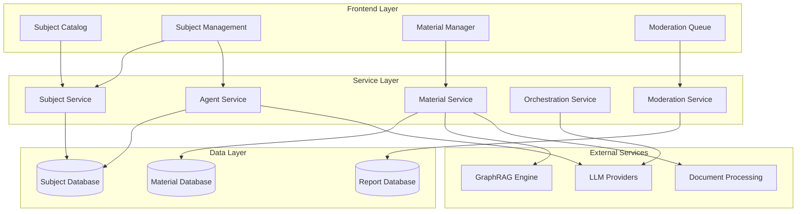

# Design Document

## Overview

The Admin Subject Management system extends the existing Learn mode to support administrative control over educational subjects with multi-agent coordination and GraphRAG-powered reference materials. The system enables both administrators and regular users to create subjects, while providing content moderation and flexible LLM provider controls.

The design builds upon the existing modular architecture with new components for subject management, agent orchestration, material processing, and content moderation.

## Architecture

### High-Level Architecture



### Integration with Existing System

The design integrates with existing modules:

- **Auth Module**: Role-based access control for admin functions
- **LLM Module**: Provider management with subject-level controls
- **Document Module**: File processing for reference materials
- **Learn Module**: Extended subject selection and interaction
- **Session Module**: Context management for multi-agent conversations

## Components and Interfaces

### 1. Subject Management Components

#### SubjectService

```javascript
class SubjectService {
  async createSubject(subjectData, creatorId, creatorRole)
  async updateSubject(subjectId, updates, userId, userRole)
  async deleteSubject(subjectId, userId, userRole)
  async getSubject(subjectId)
  async listSubjects(filters = {})
  async validateSubjectConfiguration(subjectData)
}
```

#### SubjectStore (Extended)

```javascript
// Extends existing subjects.js store
const subjectStore = {
  // Existing methods...
  addUserSubject(subject, userId),
  updateSubjectStatus(subjectId, status), // active, blocked, deleted
  reportSubject(subjectId, reportData),
  getSubjectsByCreator(userId),
  getReportedSubjects()
}
```

### 2. Agent Management Components

#### AgentService

```javascript
class AgentService {
  async createAgent(agentData, subjectId)
  async updateAgent(agentId, updates)
  async deleteAgent(agentId)
  async validateAgentConfiguration(agentData)
  async checkOrchestrationRequirement(subjectId)
}
```

#### OrchestrationService

```javascript
class OrchestrationService {
  async coordinateAgents(subjectId, userMessage, context)
  async routeToAgent(agentId, message, context)
  async aggregateResponses(responses)
  async manageConversationFlow(subjectId, conversationHistory)
}
```

### 3. Material Management Components

#### MaterialService

```javascript
class MaterialService {
  async uploadMaterial(file, subjectId, assignmentData)
  async processWithGraphRAG(materialId, content)
  async assignToAgents(materialId, agentIds)
  async updateMaterialAssignments(materialId, assignments)
  async deleteMaterial(materialId)
  async getMaterialsBySubject(subjectId)
}
```

#### GraphRAGService

```javascript
class GraphRAGService {
  async processDocument(content, metadata)
  async createKnowledgeGraph(materials)
  async queryKnowledge(query, subjectId, agentIds)
  async updateKnowledgeBase(materialId, content)
  async deleteFromKnowledgeBase(materialId)
}
```

### 4. Content Moderation Components

#### ModerationService

```javascript
class ModerationService {
  async reportSubject(subjectId, reportData, reporterId)
  async getReportQueue(adminId)
  async reviewReport(reportId, decision, adminId)
  async blockSubject(subjectId, reason, adminId)
  async deleteSubject(subjectId, reason, adminId)
  async notifyUsers(action, subjectId, userIds)
}
```

### 5. UI Components

#### Subject Catalog (Enhanced)

- Grid view of all available subjects
- Filter by creator type (admin/user), language, level
- Report functionality for each subject
- Subject status indicators

#### Subject Management Interface

- Create/edit subject form
- Agent configuration panel
- Material upload and assignment
- LLM provider settings
- Preview and validation

#### Admin Moderation Dashboard

- Report queue with filtering
- Subject review interface
- Bulk moderation actions
- User notification management

## Data Models

### Subject Model

```javascript
{
  id: string,
  name: string,
  description: string,
  creatorId: string,
  creatorRole: 'admin' | 'user',
  status: 'active' | 'blocked' | 'deleted',
  language: string,
  level: string,
  skills: string[],
  agents: Agent[],
  orchestrationAgent: Agent | null,
  materials: Material[],
  llmSettings: {
    allowOpenAI: boolean,
    preferredProvider: string,
    fallbackEnabled: boolean
  },
  metadata: {
    createdAt: Date,
    updatedAt: Date,
    reportCount: number,
    userCount: number
  }
}
```

### Agent Model

```javascript
{
  id: string,
  name: string,
  type: 'subject' | 'orchestration',
  instructions: string,
  subjectId: string,
  assignedMaterials: string[],
  configuration: {
    model: string,
    temperature: number,
    maxTokens: number
  },
  metadata: {
    createdAt: Date,
    updatedAt: Date
  }
}
```

### Material Model

```javascript
{
  id: string,
  fileName: string,
  fileType: string,
  subjectId: string,
  uploaderId: string,
  content: string,
  processedContent: {
    graphRAGNodes: object[],
    embeddings: number[][],
    metadata: object
  },
  assignments: {
    allAgents: boolean,
    specificAgents: string[]
  },
  status: 'processing' | 'ready' | 'error',
  metadata: {
    uploadedAt: Date,
    processedAt: Date,
    fileSize: number
  }
}
```

### Report Model

```javascript
{
  id: string,
  subjectId: string,
  reporterId: string,
  reason: string,
  details: string,
  status: 'pending' | 'reviewed' | 'resolved',
  reviewedBy: string | null,
  reviewedAt: Date | null,
  action: 'none' | 'blocked' | 'deleted' | null,
  metadata: {
    reportedAt: Date,
    reporterIP: string
  }
}
```

## Error Handling

### Validation Errors

- Subject configuration validation with specific error messages
- Agent requirement validation (orchestration agent for multi-agent subjects)
- Material format and size validation
- LLM provider availability checks

### Processing Errors

- GraphRAG processing failures with retry mechanisms
- Document processing errors with fallback to manual text input
- Agent coordination failures with graceful degradation
- LLM provider failures respecting subject-level restrictions

### User Experience Errors

- Clear error messages for permission denied scenarios
- Progress indicators for long-running operations (material processing)
- Rollback mechanisms for failed subject updates
- Notification system for async operations

## Testing Strategy

### Unit Tests

- Subject validation logic
- Agent orchestration algorithms
- Material processing workflows
- Permission checking functions
- GraphRAG integration points

### Integration Tests

- Subject creation end-to-end flow
- Multi-agent conversation coordination
- Material upload and processing pipeline
- Content moderation workflow
- LLM provider fallback scenarios

### User Acceptance Tests

- Admin subject management workflows
- User subject creation and interaction
- Content reporting and moderation
- Cross-browser compatibility for file uploads
- Performance testing with large materials

### Demo User Credentials

For testing and demonstration purposes, the system includes predefined user accounts:

**Admin User:**

- Email: admin@example.com
- Password: password
- Role: admin

**Student Users:**

- Email: student1@example.com
- Password: Demo123
- Role: student

- Email: student2@example.com
- Password: Demo321
- Role: student

**Existing Demo User:**

- Email: student@example.com
- Password: password
- Role: student

These accounts provide different permission levels for testing subject creation, management, and moderation workflows.

### Security Tests

- Role-based access control validation
- File upload security (malicious files)
- Input sanitization for subject content
- Rate limiting for API endpoints
- Data privacy compliance checks

## Performance Considerations

### Scalability

- Lazy loading for subject catalogs with pagination
- Caching for frequently accessed subjects and materials
- Background processing for GraphRAG operations
- Connection pooling for database operations
- CDN integration for material storage

### Optimization

- Debounced search in subject catalog
- Incremental material processing for large files
- Efficient agent routing algorithms
- Compressed material storage
- Optimized database queries with proper indexing

### Monitoring

- Performance metrics for material processing times
- Agent response time monitoring
- GraphRAG query performance tracking
- User interaction analytics
- Error rate monitoring and alerting
