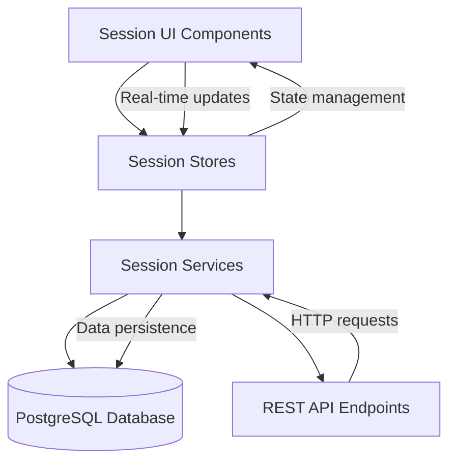

# Design Document

## Overview

The AI Tutor Sessions feature provides a comprehensive session management system that allows users to create, manage, and continue learning conversations. The system is built using SvelteKit with a scalable open-source database backend, supporting 10,000+ users with 100+ sessions each. The architecture follows the existing patterns in the codebase using Svelte stores for state management and modular service architecture.

## Architecture

### High-Level Architecture



### Database Selection

**PostgreSQL** is selected as the open-source database solution because:
- Excellent scalability (handles millions of records efficiently)
- JSONB support for flexible message storage
- Full-text search capabilities for session search
- Strong ACID compliance for data integrity
- Mature ecosystem with excellent SvelteKit integration via Prisma
- Horizontal scaling support through read replicas and partitioning

### Data Models

#### Sessions Table
```sql
CREATE TABLE sessions (
  id UUID PRIMARY KEY DEFAULT gen_random_uuid(),
  user_id VARCHAR(255) NOT NULL,
  title VARCHAR(500) NOT NULL,
  preview TEXT,
  language VARCHAR(10) DEFAULT 'en',
  mode VARCHAR(20) DEFAULT 'fun', -- 'fun' or 'learn'
  created_at TIMESTAMP DEFAULT NOW(),
  updated_at TIMESTAMP DEFAULT NOW(),
  message_count INTEGER DEFAULT 0,
  INDEX idx_user_sessions (user_id, updated_at DESC),
  INDEX idx_session_search (title, preview)
);
```

#### Messages Table
```sql
CREATE TABLE messages (
  id UUID PRIMARY KEY DEFAULT gen_random_uuid(),
  session_id UUID REFERENCES sessions(id) ON DELETE CASCADE,
  type VARCHAR(20) NOT NULL, -- 'user' or 'assistant'
  content TEXT NOT NULL,
  metadata JSONB, -- For storing audio, images, timestamps
  created_at TIMESTAMP DEFAULT NOW(),
  INDEX idx_session_messages (session_id, created_at ASC)
);
```

## Components and Interfaces

### UI Components (Svelte)

#### 1. SessionsList.svelte
- **Purpose**: Main sessions list interface with sidebar layout
- **Props**: None (uses stores)
- **Features**:
  - Real-time session filtering and search
  - Session selection and preview
  - New session creation
  - Session management actions (edit, delete)

#### 2. SessionChat.svelte  
- **Purpose**: Chat interface for active sessions
- **Props**: `sessionId`
- **Features**:
  - Message history display
  - Real-time message input/output
  - Mode switching (Fun/Learn)
  - Multimedia support (voice, images)
  - Audio playback controls

#### 3. SessionPreview.svelte
- **Purpose**: Session details and continuation options
- **Props**: `session`
- **Features**:
  - Session metadata display
  - Continue/View History actions
  - Session management options

### Stores (State Management)

#### 1. sessionStore.js
```javascript
import { writable, derived } from 'svelte/store';

const sessionStore = writable({
  sessions: [],
  currentSession: null,
  loading: false,
  error: null,
  searchQuery: '',
  selectedSessionId: null
});

// Derived stores
export const filteredSessions = derived(
  [sessionStore], 
  ([$sessions]) => filterAndSortSessions($sessions)
);

export const currentSessionMessages = derived(
  [sessionStore], 
  ([$sessions]) => getCurrentSessionMessages($sessions)
);
```

#### 2. chatStore.js
```javascript
import { writable } from 'svelte/store';

const chatStore = writable({
  messages: [],
  currentMessage: '',
  isTyping: false,
  mode: 'fun', // 'fun' or 'learn'
  language: 'en'
});
```

### Services Layer

#### 1. SessionService.js
- **Purpose**: Core session management operations
- **Methods**:
  - `createSession(userId, title, mode, language)`
  - `getUserSessions(userId, pagination)`
  - `updateSession(sessionId, updates)`
  - `deleteSession(sessionId)`
  - `searchSessions(userId, query)`

#### 2. MessageService.js
- **Purpose**: Message handling and persistence
- **Methods**:
  - `addMessage(sessionId, type, content, metadata)`
  - `getSessionMessages(sessionId, pagination)`
  - `updateMessage(messageId, content)`
  - `deleteMessage(messageId)`

#### 3. DatabaseService.js
- **Purpose**: Database connection and query management
- **Methods**:
  - `connect()` - Initialize database connection
  - `query(sql, params)` - Execute parameterized queries
  - `transaction(operations)` - Handle database transactions
  - `migrate()` - Run database migrations

### API Endpoints

#### Session Management
- `GET /api/sessions` - Get user sessions with pagination
- `POST /api/sessions` - Create new session
- `PUT /api/sessions/:id` - Update session
- `DELETE /api/sessions/:id` - Delete session
- `GET /api/sessions/search` - Search sessions

#### Message Management  
- `GET /api/sessions/:id/messages` - Get session messages
- `POST /api/sessions/:id/messages` - Add new message
- `PUT /api/messages/:id` - Update message
- `DELETE /api/messages/:id` - Delete message

## Data Models

### Session Model
```typescript
interface Session {
  id: string;
  userId: string;
  title: string;
  preview?: string;
  language: string;
  mode: 'fun' | 'learn';
  createdAt: Date;
  updatedAt: Date;
  messageCount: number;
}
```

### Message Model
```typescript
interface Message {
  id: string;
  sessionId: string;
  type: 'user' | 'assistant';
  content: string;
  metadata?: {
    timestamp?: string;
    audioUrl?: string;
    imageUrl?: string;
    language?: string;
  };
  createdAt: Date;
}
```

### Session State Model
```typescript
interface SessionState {
  sessions: Session[];
  currentSession: Session | null;
  loading: boolean;
  error: string | null;
  searchQuery: string;
  selectedSessionId: string | null;
}
```

## Error Handling

### Database Error Handling
- **Connection Failures**: Implement connection pooling with retry logic
- **Query Timeouts**: Set appropriate timeout limits with fallback responses
- **Data Integrity**: Use database constraints and application-level validation
- **Migration Errors**: Implement rollback mechanisms for failed migrations

### Application Error Handling
- **Session Not Found**: Return appropriate 404 responses with user-friendly messages
- **Unauthorized Access**: Validate user ownership of sessions before operations
- **Validation Errors**: Provide detailed field-level error messages
- **Network Failures**: Implement offline support with local caching

### User Experience Error Handling
- **Loading States**: Show skeleton loaders during data fetching
- **Empty States**: Provide helpful messages and actions for empty session lists
- **Error Recovery**: Allow users to retry failed operations
- **Data Loss Prevention**: Auto-save drafts and warn before destructive actions

## Testing Strategy

### Unit Tests
- **Store Logic**: Test all store operations and derived values
- **Service Methods**: Test CRUD operations with mocked database
- **Utility Functions**: Test search, filtering, and formatting functions
- **Component Logic**: Test component state management and event handling

### Integration Tests
- **Database Operations**: Test actual database queries with test database
- **API Endpoints**: Test full request/response cycles
- **Store-Service Integration**: Test data flow between layers
- **Component-Store Integration**: Test UI state synchronization

### End-to-End Tests
- **Session Creation Flow**: Test complete session creation process
- **Chat Interaction Flow**: Test message sending and receiving
- **Session Management**: Test editing, deleting, and searching sessions
- **Cross-Device Sync**: Test session access from multiple devices

### Performance Tests
- **Database Query Performance**: Test query execution times with large datasets
- **Pagination Performance**: Test session loading with 100+ sessions per user
- **Search Performance**: Test search functionality with full-text queries
- **Concurrent User Load**: Test system behavior with 1000+ concurrent users

## Security Considerations

### Data Protection
- **User Isolation**: Ensure users can only access their own sessions
- **Input Sanitization**: Sanitize all user inputs to prevent XSS attacks
- **SQL Injection Prevention**: Use parameterized queries exclusively
- **Data Encryption**: Encrypt sensitive data at rest and in transit

### Authentication & Authorization
- **Session Validation**: Validate user sessions on every request
- **Rate Limiting**: Implement rate limiting for API endpoints
- **CORS Configuration**: Configure appropriate CORS policies
- **Input Validation**: Validate all inputs on both client and server

## Performance Optimization

### Database Optimization
- **Indexing Strategy**: Create indexes on frequently queried columns
- **Query Optimization**: Use efficient queries with proper joins and limits
- **Connection Pooling**: Implement database connection pooling
- **Caching Layer**: Add Redis caching for frequently accessed data

### Frontend Optimization
- **Lazy Loading**: Load sessions and messages on demand
- **Virtual Scrolling**: Implement virtual scrolling for large message lists
- **Debounced Search**: Debounce search input to reduce API calls
- **Optimistic Updates**: Update UI immediately before server confirmation

### Scalability Considerations
- **Horizontal Scaling**: Design for read replica support
- **Data Partitioning**: Plan for session data partitioning by user or date
- **CDN Integration**: Use CDN for static assets and media files
- **Microservice Architecture**: Design services for independent scaling