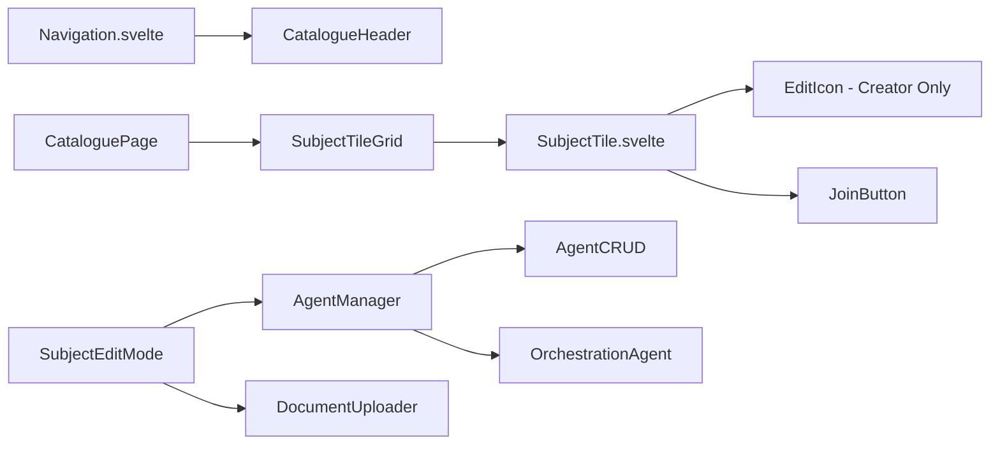
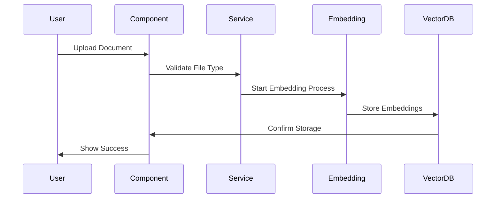
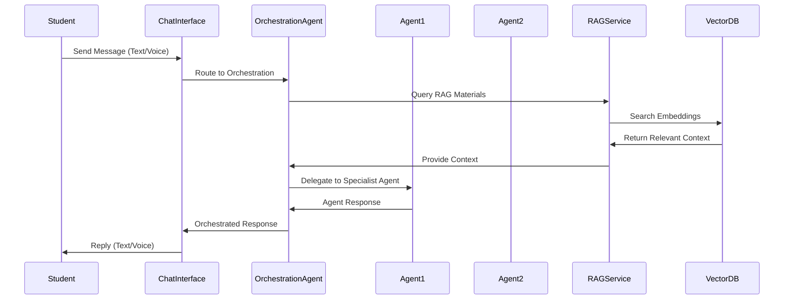

# Design Document

## Overview

The Catalogue UX Enhancement transforms the current learning system into a more intuitive, user-friendly catalogue interface. This design addresses the need for better navigation, enhanced subject management capabilities, and improved user experience through role-based editing, agent management, and document upload functionality.

The solution builds upon the existing SvelteKit architecture and modular component system, extending current functionality rather than replacing it entirely.

## Architecture

### High-Level Architecture

```mermaid
graph TB
    A[Header Navigation] --> B[Catalogue Route /catalogue]
    B --> C[Subject Tiles Grid]
    C --> D[Subject Edit Mode]
    D --> E[Agent Management]
    D --> F[Document Upload]

    G[User Enrollment] --> H[My Subjects Dropdown]

    I[Route Handling] --> J[/learn → /catalogue redirect]
    I --> K[Remove /admin/subjects]

    L[Permission System] --> M[Creator-only Edit Icons]
    L --> N[Role-based CRUD Operations]
```

### Component Architecture



## Components and Interfaces

### 1. Navigation Enhancement

**Component**: `Navigation.svelte` (Modified)

- Add "Catalogue" link in header
- Implement "My Subjects" dropdown for enrolled users
- Remove obsolete admin/subjects link

**Interface Changes**:

```javascript
// Navigation props
{
  user: User,
  enrolledSubjects: Subject[],
  showMySubjects: boolean
}
```

### 2. Catalogue Page

**New Component**: `CataloguePage.svelte`

- Replaces current `/learn` route functionality
- Displays subject tiles in grid layout
- Handles routing from `/learn` to `/catalogue`

**Component Structure**:

```javascript
// CataloguePage.svelte
{
  subjects: Subject[],
  currentUser: User,
  onSubjectJoin: (subjectId) => void,
  onSubjectEdit: (subjectId) => void,
  onSubjectReport: (subjectId, reason) => void
}
```

### 3. Enhanced Subject Tile

**Modified Component**: `SubjectTile.svelte`

- Shortened content display
- Creator-only edit icon
- "Join" button instead of "Take Assessment"/"Learn"
- Maintained "Report" functionality

**Tile Layout**:

```
┌─────────────────────────────────┐
│ [Icon] [Report]     [Edit Icon] │
│ Subject Title                   │
│ Language · Level                │
│ Short Description...            │
│ [Skill] [Skill] [Skill]        │
│ [Join Button]                   │
└─────────────────────────────────┘
```

### 4. Subject Edit Mode

**New Component**: `SubjectEditMode.svelte`

- Full subject editing interface
- Agent management section
- Document upload section
- Form validation and error handling

### 5. Agent Management System

**New Component**: `AgentManager.svelte`

- CRUD operations for agents
- Automatic orchestration agent creation/removal
- Agent configuration validation

**Agent Management Logic**:

```javascript
class AgentManager {
  addAgent(name, description) {
    // Add agent
    // Check if orchestration needed (>= 2 agents)
    // Auto-create orchestration agent if needed
  }

  removeAgent(agentId) {
    // Remove agent
    // Check if orchestration still needed (< 2 agents)
    // Auto-remove orchestration agent if not needed
  }

  updateAgent(agentId, updates) {
    // Update agent configuration
    // Validate configuration
  }
}
```

### 6. Document Upload System

**New Component**: `DocumentUploader.svelte`

- File upload interface (TXT, PDF only)
- Upload progress indication
- Integration with embedding pipeline

**Upload Flow**:



### 7. Agent-Based Communication System

**Enhanced Component**: `ChatInterface.svelte` (Modified)

- Integration with subject agents and RAG materials
- Multi-agent orchestration for complex subjects
- Context-aware responses based on uploaded materials

**Communication Flow**:



**Agent Communication Logic**:

```javascript
class AgentCommunicationService {
  async processStudentMessage(message, subjectId, userId) {
    const subject = await this.getSubject(subjectId);
    const ragContext = await this.getRagContext(message, subject.materials);

    if (subject.agents.length === 1) {
      // Single agent communication
      return await this.singleAgentResponse(subject.agents[0], message, ragContext);
    } else {
      // Multi-agent orchestration
      return await this.orchestratedResponse(subject, message, ragContext);
    }
  }

  async orchestratedResponse(subject, message, ragContext) {
    const orchestrationAgent = subject.orchestrationAgent;
    const pipeline = orchestrationAgent.pipelineDescription;

    // Determine which agent(s) should handle the message
    const selectedAgents = await this.selectAgents(message, subject.agents, pipeline);

    // Coordinate agent responses
    const responses = await this.coordinateAgents(selectedAgents, message, ragContext);

    // Synthesize final response
    return await this.synthesizeResponse(responses, orchestrationAgent);
  }
}
```

## Data Models

### Enhanced Subject Model

```javascript
interface Subject {
  id: string;
  name: string;
  description: string;
  shortDescription: string; // New: for tile display
  language: string;
  level: string;
  skills: string[];
  creatorId: string;
  creatorRole: 'admin' | 'user';
  status: 'active' | 'blocked' | 'deleted';

  // Enhanced agent system
  agents: Agent[];
  orchestrationAgent?: OrchestrationAgent;

  // Document system for RAG
  materials: Material[];
  ragConfiguration: {
    enabled: boolean;
    searchThreshold: number;
    maxContextLength: number;
    contextRelevanceWeight: number;
  };

  // Communication settings
  communicationMode: 'text' | 'voice' | 'both';
  voiceSettings?: {
    language: string;
    voice: string;
    speed: number;
  };

  // Enrollment tracking
  enrolledUsers: string[];

  // Existing fields...
  practice: PracticeConfig;
  exam: ExamConfig;
  settings: SubjectSettings;
  metadata: SubjectMetadata;
}
```

### Agent Models

```javascript
interface Agent {
  id: string;
  name: string;
  description: string;
  type: 'standard' | 'orchestration';
  instructions: string; // Core agent behavior instructions
  systemPrompt: string; // LLM system prompt
  configuration: AgentConfig;
  ragEnabled: boolean; // Whether this agent uses RAG
  communicationStyle: {
    tone: string;
    formality: 'formal' | 'casual' | 'adaptive';
    responseLength: 'concise' | 'detailed' | 'adaptive';
  };
  createdAt: Date;
  updatedAt: Date;
}

interface OrchestrationAgent extends Agent {
  type: 'orchestration';
  pipelineDescription: string; // How agents work together
  agentCoordination: {
    workflow: string; // Agent selection and routing logic
    communication: string; // How agents communicate with each other
    behavior: string; // Overall system behavior
  };
  routingRules: {
    messageTypes: Record<string, string[]>; // Message type -> agent IDs
    fallbackAgent: string; // Default agent ID
    escalationRules: string; // When to involve multiple agents
  };
}
```

### Material Model

```javascript
interface Material {
  id: string;
  filename: string;
  originalName: string;
  fileType: 'txt' | 'pdf';
  size: number;
  uploadedAt: Date;
  embeddingStatus: 'pending' | 'processing' | 'completed' | 'failed';
  vectorIds: string[]; // References to vector DB entries

  // RAG-specific metadata
  chunkCount: number;
  averageChunkSize: number;
  topics: string[]; // Extracted topics/keywords
  language: string; // Detected language

  // Usage tracking
  queryCount: number; // How often this material is referenced
  lastQueried: Date;
  relevanceScore: number; // Overall relevance to subject
}
```

### User Enrollment Model

```javascript
interface UserEnrollment {
  userId: string;
  subjectId: string;
  enrolledAt: Date;
  status: 'active' | 'completed' | 'dropped';
  progress: {
    lessonsCompleted: number;
    assessmentsTaken: number;
    lastActivity: Date;
  };
}
```

## Error Handling

### Client-Side Error Handling

```javascript
// Error handling for file uploads
class DocumentUploadError extends Error {
  constructor(message, code, details) {
    super(message);
    this.code = code;
    this.details = details;
  }
}

// Error codes
const ERROR_CODES = {
  INVALID_FILE_TYPE: 'INVALID_FILE_TYPE',
  FILE_TOO_LARGE: 'FILE_TOO_LARGE',
  UPLOAD_FAILED: 'UPLOAD_FAILED',
  EMBEDDING_FAILED: 'EMBEDDING_FAILED',
  PERMISSION_DENIED: 'PERMISSION_DENIED'
};
```

### Error Recovery Strategies

1. **File Upload Failures**: Retry mechanism with exponential backoff
2. **Permission Errors**: Clear user feedback and redirect to appropriate page
3. **Agent Configuration Errors**: Validation with specific error messages
4. **Network Failures**: Offline capability with sync when reconnected

## Testing Strategy

### Unit Tests

1. **Component Tests**:
   - `CataloguePage.svelte` rendering and interactions
   - `SubjectTile.svelte` permission-based display
   - `AgentManager.svelte` CRUD operations
   - `DocumentUploader.svelte` file validation

2. **Service Tests**:
   - `SubjectService` enhanced CRUD operations
   - `AgentService` orchestration logic
   - `MaterialService` upload and embedding
   - `EnrollmentService` user enrollment tracking

3. **Store Tests**:
   - Subject store with enrollment data
   - User enrollment state management
   - Agent configuration validation

### Integration Tests

1. **Route Integration**:
   - `/learn` to `/catalogue` redirect
   - `/admin/subjects` removal
   - Navigation link functionality

2. **Permission Integration**:
   - Creator-only edit icon display
   - Role-based CRUD operations
   - Enrollment-based "My Subjects" display

3. **File Upload Integration**:
   - End-to-end upload process
   - Embedding pipeline integration
   - Vector DB storage verification

### End-to-End Tests

1. **User Journey Tests**:
   - Browse catalogue → Join subject → Access "My Subjects"
   - Creator workflow: Create subject → Add agents → Upload materials
   - Admin workflow: Moderate subjects → Manage reports

2. **Cross-Browser Tests**:
   - File upload functionality
   - Responsive design on mobile/tablet
   - Dark mode compatibility

## Implementation Phases

### Phase 1: Core Catalogue Infrastructure

- Route changes (`/learn` → `/catalogue`)
- Basic catalogue page with enhanced tiles
- Navigation header updates
- "Join" button functionality

### Phase 2: User Enrollment System

- User enrollment tracking
- "My Subjects" dropdown
- Enrollment status management

### Phase 3: Creator Edit Mode

- Subject edit interface
- Permission-based edit icon display
- Basic subject modification

### Phase 4: Agent Management

- Agent CRUD operations with instruction fields
- Orchestration agent auto-creation
- Agent configuration validation
- Communication style settings

### Phase 5: Document Upload & RAG System

- File upload interface
- Embedding pipeline integration
- Material management
- RAG context retrieval system

### Phase 6: Agent-Based Communication

- Enhanced chat interface with agent integration
- Multi-agent orchestration logic
- RAG-powered responses
- Voice communication with agent instructions

### Phase 7: Cleanup and Polish

- Remove `/admin/subjects` route
- Performance optimizations
- Accessibility improvements
- Comprehensive testing

## Security Considerations

### Permission System

- Role-based access control for edit operations
- Creator-only modification rights
- Admin override capabilities

### File Upload Security

- File type validation (whitelist: TXT, PDF only)
- File size limits
- Virus scanning integration
- Secure file storage

### Data Validation

- Input sanitization for all user-generated content
- Agent configuration validation
- Subject data integrity checks

## Performance Considerations

### Client-Side Optimization

- Lazy loading for subject tiles
- Virtual scrolling for large catalogues
- Image optimization for subject icons
- Component-level caching

### Server-Side Optimization

- Efficient database queries for subject listing
- Pagination for large datasets
- Caching for frequently accessed subjects
- Background processing for embeddings

### File Upload Optimization

- Chunked upload for large files
- Progress indication
- Background processing
- Retry mechanisms

## Accessibility

### WCAG 2.1 AA Compliance

- Keyboard navigation for all interactive elements
- Screen reader compatibility
- High contrast mode support
- Focus management for modals and dropdowns

### Specific Considerations

- Alt text for subject icons
- Descriptive button labels
- Form validation with clear error messages
- Proper heading hierarchy
