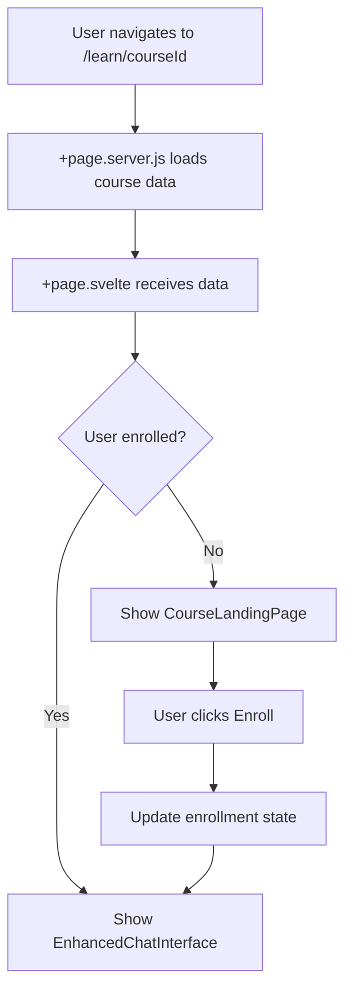

# Design Document

## Overview

This document outlines the technical design for redesigning the course detail page (`/learn/[courseId]`) from a minimal chat-focused interface to a modern, engaging landing page with comprehensive course information. The redesign will create a two-phase user experience:

1. **Landing Phase**: A beautiful, informative course overview page for non-enrolled or newly visiting users
2. **Learning Phase**: The existing chat interface for enrolled users who are ready to learn

The design maintains backward compatibility with the existing SvelteKit architecture, Prisma database schema, and authentication system while introducing new UI components and state management for enrollment flow.

## Architecture

### Component Structure

```
src/routes/learn/[courseId]/
├── +page.svelte (Main orchestrator - updated)
├── +page.server.js (Server-side data loading - minimal changes)
└── components/
    ├── CourseLandingPage.svelte (NEW - landing page layout)
    ├── CourseHero.svelte (NEW - hero section)
    ├── CourseInfoSidebar.svelte (NEW - sticky sidebar)
    ├── InstructorProfiles.svelte (NEW - AI agents display)
    ├── SkillsSection.svelte (NEW - learning outcomes)
    └── LearningFormatSection.svelte (NEW - format info)
```

### State Management

The page will manage three primary states:

1. **Loading State**: Initial data fetch and authentication check
2. **Landing State**: Course overview for unenrolled users
3. **Learning State**: Chat interface for enrolled users

State transitions:
```
Loading → Landing (if not enrolled)
Loading → Learning (if enrolled)
Landing → Learning (on enrollment)
```

### Data Flow



## Components and Interfaces

### 1. CourseLandingPage.svelte

Main landing page component that orchestrates all sub-components.

**Props:**
```typescript
interface CourseLandingPageProps {
  course: {
    id: string;
    name: string;
    description: string;
    language: string;
    level: string;
    skills: string[];
    agents: Agent[];
    status: string;
  };
  enrolled: boolean;
  studentCount: number;
  onEnroll: () => void;
  onStartLearning: () => void;
}
```

**Responsibilities:**
- Layout orchestration (hero, main content, sidebar)
- Responsive grid management
- Event handling for enrollment actions

### 2. CourseHero.svelte

Hero section with gradient background and primary CTA.

**Props:**
```typescript
interface CourseHeroProps {
  courseName: string;
  description: string;
  level: string;
  language: string;
  studentCount: number;
  enrolled: boolean;
  onEnroll: () => void;
}
```

**Visual Design:**
- Gradient background: `bg-gradient-to-r from-orange-500 to-amber-500`
- Typography: `text-5xl font-bold` for title
- White text with semi-transparent badges
- Prominent CTA button with hover effects

### 3. CourseInfoSidebar.svelte

Sticky sidebar with course metadata and enrollment CTA.

**Props:**
```typescript
interface CourseInfoSidebarProps {
  level: string;
  language: string;
  studentCount: number;
  agentCount: number;
  enrolled: boolean;
  onEnroll: () => void;
}
```

**Behavior:**
- Sticky positioning on desktop (`sticky top-8`)
- Stacks below content on mobile
- Displays "What's Included" feature list
- Mirrors enrollment button from hero

### 4. InstructorProfiles.svelte

Displays AI agent profiles with detailed information.

**Props:**
```typescript
interface InstructorProfilesProps {
  agents: Agent[];
}

interface Agent {
  name: string;
  role: string;
  description: string;
  tone: string;
  formality: string;
  systemPrompt?: string;
}
```

**Visual Design:**
- Gradient cards: `bg-gradient-to-r from-gray-50 to-orange-50`
- Icon placeholder for each agent
- Tone and formality badges
- Hover effects for interactivity

### 5. SkillsSection.svelte

Grid display of learning outcomes.

**Props:**
```typescript
interface SkillsSectionProps {
  skills: string[];
}
```

**Layout:**
- 2-column grid on desktop, 1-column on mobile
- Checkmark icons with orange accent
- Hover effects on skill cards

### 6. LearningFormatSection.svelte

Information about the learning experience.

**Props:**
```typescript
interface LearningFormatSectionProps {
  // Static content, no props needed
}
```

**Content:**
- AI Assistants: 24/7 availability
- Materials: Included resources
- Practice: Interactive exercises

## Data Models

### Course Data (from server)

The existing course data structure from `+page.server.js` will be used:

```typescript
interface CourseData {
  id: string;
  name: string;
  description: string;
  language: string;
  level: string;
  skills: string[];
  practice: any;
  exam: any;
  agents: Agent[];
  orchestrationAgent: Agent | null;
  materials: any[];
  llmSettings: any;
  status: string;
}
```

### Enrollment State

New client-side state to track enrollment:

```typescript
interface EnrollmentState {
  enrolled: boolean;
  loading: boolean;
  error: string | null;
}
```

### Student Count

Will be fetched from the database (requires new query):

```sql
SELECT COUNT(*) as studentCount 
FROM Enrollment 
WHERE courseId = ? AND status = 'active'
```

## Error Handling

### Client-Side Errors

1. **Enrollment Failure**: Display inline error message, allow retry
2. **Data Loading Failure**: Show error state with retry button
3. **Navigation Failure**: Fallback to error page

### Server-Side Errors

Existing error handling in `+page.server.js` will be maintained:
- 400: Invalid course ID
- 401: Authentication required
- 403: Course not available
- 404: Course not found
- 500: Server error

## Testing Strategy

### Unit Tests

1. **Component Tests**:
   - CourseLandingPage renders correctly with mock data
   - CourseHero displays correct enrollment state
   - InstructorProfiles handles empty agents array
   - SkillsSection handles empty skills array
   - Sidebar sticky behavior

2. **State Management Tests**:
   - Enrollment state transitions
   - Error state handling
   - Loading state behavior

### Integration Tests

1. **Page Flow Tests**:
   - Landing page → Enrollment → Chat interface
   - Enrolled user directly sees chat interface
   - Back navigation maintains state

2. **Responsive Tests**:
   - Mobile layout stacking
   - Tablet layout adaptation
   - Desktop sidebar positioning

### E2E Tests

1. **User Journey Tests**:
   - Unenrolled user views course and enrolls
   - Enrolled user accesses course directly
   - Navigation between courses
   - Error scenarios (invalid course ID, etc.)

## Implementation Phases

### Phase 1: Component Creation
- Create all new Svelte components
- Implement basic layouts and styling
- Add Lucide icons integration

### Phase 2: State Management
- Add enrollment state to +page.svelte
- Implement enrollment flow
- Add loading and error states

### Phase 3: Data Integration
- Fetch student count from database
- Map course agents to instructor profiles
- Integrate with existing course data

### Phase 4: Responsive Design
- Implement mobile layouts
- Add tablet breakpoints
- Test sticky sidebar behavior

### Phase 5: Integration with Chat
- Connect enrollment flow to chat interface
- Maintain course context across states
- Test state transitions

### Phase 6: Polish and Testing
- Add animations and transitions
- Implement hover effects
- Write and run all tests

## Technical Considerations

### Performance

1. **Code Splitting**: New components will be lazy-loaded
2. **Image Optimization**: Use optimized icons from Lucide
3. **CSS**: Utilize Tailwind's JIT compiler for minimal CSS bundle

### Accessibility

1. **Semantic HTML**: Use proper heading hierarchy
2. **ARIA Labels**: Add labels for interactive elements
3. **Keyboard Navigation**: Ensure all actions are keyboard accessible
4. **Color Contrast**: Maintain WCAG AA standards

### Browser Compatibility

- Target: Modern browsers (Chrome, Firefox, Safari, Edge)
- Fallbacks: Graceful degradation for older browsers
- Progressive Enhancement: Core functionality works without JS

### Internationalization

The page will use the existing i18n system:
- Course content comes from database (already localized)
- UI labels will use existing translation keys
- New translation keys needed:
  - `course.enrollButton`
  - `course.startLearning`
  - `course.whatYouLearn`
  - `course.yourInstructors`
  - `course.learningFormat`
  - `course.whatsIncluded`

## Security Considerations

1. **Authentication**: Maintain existing auth checks
2. **Authorization**: Verify user can access course
3. **XSS Prevention**: Sanitize course descriptions (already handled by Svelte)
4. **CSRF Protection**: Use SvelteKit's built-in CSRF protection

## Migration Strategy

### Backward Compatibility

The redesign maintains full backward compatibility:
- Existing enrolled users see chat interface immediately
- Course data structure unchanged
- API endpoints unchanged
- Authentication flow unchanged

### Rollout Plan

1. **Development**: Build and test in dev environment
2. **Staging**: Deploy to staging for QA
3. **Feature Flag**: Optional feature flag for gradual rollout
4. **Production**: Deploy to production
5. **Monitoring**: Monitor user engagement and error rates

## Design Tokens

### Colors

```css
/* Primary */
--color-orange-500: #f97316;
--color-amber-500: #f59e0b;

/* Backgrounds */
--color-orange-50: #fff7ed;
--color-amber-50: #fffbeb;

/* Neutrals */
--color-gray-50: #f9fafb;
--color-gray-900: #111827;
```

### Spacing

Using Tailwind's spacing scale:
- Container padding: `px-4 sm:px-6 lg:px-8`
- Section spacing: `py-12`
- Card padding: `p-6` or `p-8`
- Gap between elements: `gap-4`, `gap-6`, `gap-8`

### Typography

```css
/* Hero Title */
font-size: 3rem; /* text-5xl */
font-weight: 700; /* font-bold */

/* Section Headings */
font-size: 1.875rem; /* text-3xl */
font-weight: 700; /* font-bold */

/* Body Text */
font-size: 1rem; /* text-base */
line-height: 1.5;
```

### Border Radius

- Cards: `rounded-2xl` (1rem)
- Buttons: `rounded-lg` (0.5rem)
- Badges: `rounded-full`

## Dependencies

### New Dependencies

None required - all functionality uses existing dependencies:
- Svelte/SvelteKit (existing)
- Tailwind CSS (existing)
- Lucide Svelte (existing)
- Prisma (existing)

### Updated Components

- `src/routes/learn/[courseId]/+page.svelte`: Major update
- `src/routes/learn/[courseId]/+page.server.js`: Minor update (add student count query)

## Monitoring and Analytics

### Metrics to Track

1. **Engagement**:
   - Time spent on landing page
   - Enrollment conversion rate
   - Bounce rate

2. **Performance**:
   - Page load time
   - Time to interactive
   - Component render time

3. **Errors**:
   - Enrollment failures
   - Navigation errors
   - Component errors

### Logging

Add structured logging for:
- Enrollment attempts
- State transitions
- Error conditions
- Performance metrics
