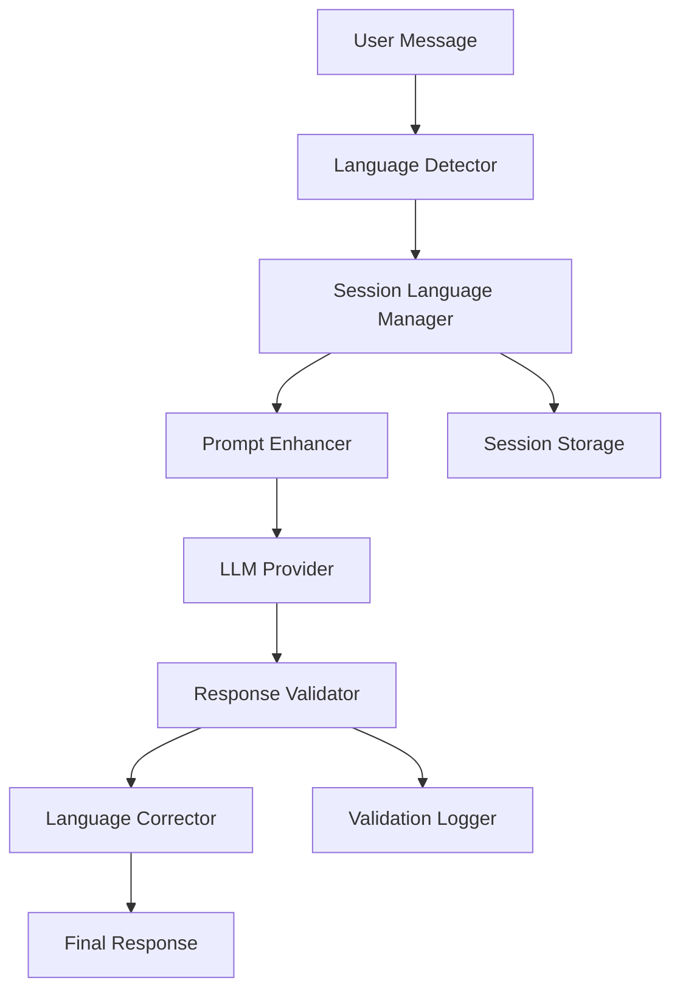

# Design Document

## Overview

This design addresses the language consistency issue where the AI tutor switches languages mid-conversation (e.g., from Russian to Chinese). The solution involves implementing a multi-layered language enforcement system that operates at the prompt level, response validation level, and session management level.

## Architecture

The language consistency system will be implemented as a middleware layer between the chat API and the LLM providers, with the following components:



## Components and Interfaces

### 1. Language Detector Enhancement

**Location**: `src/lib/modules/chat/LanguageDetector.js` (existing, to be enhanced)

**Enhancements**:
- Improve text-based language detection accuracy
- Add confidence scoring for detection results
- Implement language persistence for session context

**Interface**:
```javascript
class LanguageDetector {
  detectLanguageFromText(text) // existing
  syncLanguageFromText(text) // existing
  detectWithConfidence(text) // new
  validateLanguageConsistency(text, expectedLanguage) // new
}
```

### 2. Session Language Manager

**Location**: `src/lib/modules/chat/SessionLanguageManager.js` (new)

**Purpose**: Manage language state throughout a conversation session

**Interface**:
```javascript
class SessionLanguageManager {
  setSessionLanguage(sessionId, language, confidence)
  getSessionLanguage(sessionId)
  updateLanguageConfidence(sessionId, newConfidence)
  isLanguageStable(sessionId)
}
```

### 3. Prompt Enhancer

**Location**: `src/lib/modules/chat/PromptEnhancer.js` (new)

**Purpose**: Enhance system prompts with explicit language instructions

**Interface**:
```javascript
class PromptEnhancer {
  enhanceSystemPrompt(originalPrompt, targetLanguage, confidence)
  addLanguageConstraints(messages, targetLanguage)
  createLanguageEnforcementPrompt(language)
}
```

### 4. Response Validator

**Location**: `src/lib/modules/chat/ResponseValidator.js` (new)

**Purpose**: Validate AI responses for language consistency

**Interface**:
```javascript
class ResponseValidator {
  validateLanguage(response, expectedLanguage)
  detectLanguageMixing(response)
  calculateLanguageScore(response, expectedLanguage)
}
```

### 5. Language Corrector

**Location**: `src/lib/modules/chat/LanguageCorrector.js` (new)

**Purpose**: Attempt to correct language inconsistencies

**Interface**:
```javascript
class LanguageCorrector {
  correctResponse(response, targetLanguage)
  regenerateResponse(messages, targetLanguage, providerManager)
  translateMixedContent(response, targetLanguage)
}
```

## Data Models

### Language Session State
```javascript
{
  sessionId: string,
  detectedLanguage: string,
  confidence: number,
  lastUpdated: timestamp,
  validationHistory: Array<{
    timestamp: timestamp,
    expectedLanguage: string,
    actualLanguage: string,
    confidence: number,
    correctionApplied: boolean
  }>
}
```

### Language Validation Result
```javascript
{
  isValid: boolean,
  detectedLanguage: string,
  confidence: number,
  mixedLanguages: Array<string>,
  needsCorrection: boolean,
  correctionMethod: 'regenerate' | 'translate' | 'none'
}
```

## Error Handling

### Language Detection Failures
- **Fallback**: Use session language history or default to English
- **Logging**: Record detection failures for analysis
- **User Notification**: Transparent handling without disrupting conversation flow

### Response Validation Failures
- **Primary Strategy**: Regenerate response with enhanced language constraints
- **Secondary Strategy**: Attempt translation of mixed content
- **Fallback**: Log issue and proceed with original response

### Correction Failures
- **Graceful Degradation**: Use original response with logged warning
- **User Experience**: Maintain conversation flow without errors
- **Monitoring**: Track correction failure rates for system improvement

## Testing Strategy

### Unit Tests
- Language detection accuracy across different text samples
- Prompt enhancement with various language combinations
- Response validation with mixed-language content
- Session language management state transitions

### Integration Tests
- End-to-end language consistency in chat flow
- Provider fallback behavior with language constraints
- Session persistence across multiple interactions
- Performance impact of validation layer

### Language-Specific Tests
- Russian text detection and validation
- Chinese text detection (to prevent unwanted switches)
- Spanish text handling
- Mixed-language content scenarios

## Implementation Phases

### Phase 1: Core Language Management
1. Enhance LanguageDetector with confidence scoring
2. Implement SessionLanguageManager
3. Create basic PromptEnhancer
4. Update chat API to use language management

### Phase 2: Response Validation
1. Implement ResponseValidator
2. Add validation to chat API response flow
3. Implement basic logging for validation results
4. Add performance monitoring

### Phase 3: Correction and Recovery
1. Implement LanguageCorrector
2. Add regeneration logic for failed validations
3. Implement translation fallback
4. Add comprehensive error handling

### Phase 4: Optimization and Monitoring
1. Add detailed analytics for language consistency
2. Optimize validation performance
3. Implement adaptive confidence thresholds
4. Add user feedback mechanisms

## Configuration

### Language Validation Settings
```javascript
export const LANGUAGE_VALIDATION_CONFIG = {
  // Minimum confidence threshold for language detection
  MIN_CONFIDENCE_THRESHOLD: 0.7,
  
  // Enable automatic response regeneration
  ENABLE_AUTO_REGENERATION: true,
  
  // Maximum regeneration attempts
  MAX_REGENERATION_ATTEMPTS: 2,
  
  // Enable translation fallback
  ENABLE_TRANSLATION_FALLBACK: true,
  
  // Languages to validate against
  SUPPORTED_LANGUAGES: ['en', 'es', 'ru'],
  
  // Validation timeout in milliseconds
  VALIDATION_TIMEOUT: 5000
};
```

### Prompt Enhancement Templates
```javascript
export const LANGUAGE_PROMPTS = {
  ru: {
    enforcement: "КРИТИЧЕСКИ ВАЖНО: Отвечай ТОЛЬКО на русском языке. Никогда не используй китайский, английский или другие языки в своем ответе.",
    validation: "Проверь, что весь твой ответ написан на русском языке перед отправкой."
  },
  en: {
    enforcement: "CRITICAL: Respond ONLY in English. Never use Russian, Chinese, or other languages in your response.",
    validation: "Verify that your entire response is in English before sending."
  },
  es: {
    enforcement: "CRÍTICO: Responde SOLO en español. Nunca uses ruso, chino u otros idiomas en tu respuesta.",
    validation: "Verifica que toda tu respuesta esté en español antes de enviar."
  }
};
```