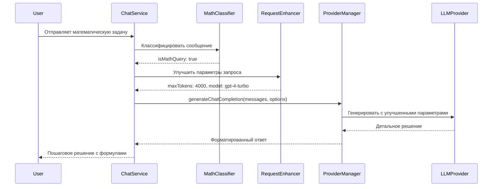

# Design Document

## Overview

Этот дизайн описывает улучшение математических возможностей AI-тьютора через:

1. Автоматическое определение математических запросов
2. Динамическое увеличение лимита токенов для детальных решений
3. Использование более мощных моделей для математики
4. Обновление дефолтных настроек агентов

## Architecture

### High-Level Architecture

```
User Message
     ↓
[Message Classifier] ← определяет тип запроса (математика/обычный)
     ↓
[Request Enhancer] ← увеличивает maxTokens для математики
     ↓
[ProviderManager] ← выбирает подходящую модель
     ↓
[LLM Provider] ← генерирует ответ
     ↓
Response with detailed solution
```

### Component Interaction



## Components and Interfaces

### 1. MathQueryClassifier

**Назначение:** Определяет, является ли запрос математическим

**Расположение:** `src/lib/modules/llm/classifiers/MathQueryClassifier.js`

**Interface:**

```javascript
class MathQueryClassifier {
  /**
   * Классифицирует сообщение как математическое или нет
   * @param {string} message - Текст сообщения
   * @param {Array} context - Предыдущие сообщения для контекста
   * @returns {Object} { isMath: boolean, confidence: number, category: string }
   */
  classify(message, context = [])

  /**
   * Определяет категорию математической задачи
   * @param {string} message - Текст сообщения
   * @returns {string} Категория: 'algebra', 'geometry', 'calculus', 'probability', etc.
   */
  getMathCategory(message)
}
```

**Логика классификации:**

- Поиск математических ключевых слов (решить, вычислить, найти, доказать, etc.)
- Обнаружение математических символов и формул (=, +, -, ×, ÷, ∫, ∑, etc.)
- Обнаружение чисел и уравнений
- Анализ контекста предыдущих сообщений
- Confidence score для неоднозначных случаев

### 2. RequestEnhancer

**Назначение:** Улучшает параметры запроса для математических задач

**Расположение:** `src/lib/modules/llm/enhancers/RequestEnhancer.js`

**Interface:**

```javascript
class RequestEnhancer {
  /**
   * Улучшает параметры запроса на основе классификации
   * @param {Object} options - Исходные параметры запроса
   * @param {Object} classification - Результат классификации
   * @returns {Object} Улучшенные параметры
   */
  enhance(options, classification)

  /**
   * Получает оптимальные параметры для математических задач
   * @param {string} category - Категория математики
   * @returns {Object} { maxTokens, temperature, model }
   */
  getMathParameters(category)
}
```

**Логика улучшения:**

- Если `isMath === true` и `maxTokens < 4000` → установить `maxTokens = 4000`
- Для сложных категорий (calculus, proofs) → `maxTokens = 4000`
- Для простых (arithmetic) → `maxTokens = 2000`
- Снизить temperature до 0.3 для более точных вычислений
- Добавить system prompt для пошагового решения

### 3. Обновление ProviderManager

**Изменения:** Интеграция классификатора и enhancer

**Расположение:** `src/lib/modules/llm/ProviderManager.js`

**Новый метод:**

```javascript
/**
 * Генерирует ответ с автоматическим улучшением для математики
 * @param {Array} messages - Сообщения
 * @param {Object} options - Параметры
 * @returns {Promise<Object>} Ответ с метаданными
 */
async generateChatCompletionWithEnhancement(messages, options = {})
```

**Логика:**

1. Извлечь последнее сообщение пользователя
2. Классифицировать через MathQueryClassifier
3. Если математика → улучшить параметры через RequestEnhancer
4. Добавить system prompt для математики
5. Вызвать существующий `generateChatCompletion` с улучшенными параметрами
6. Вернуть ответ с метаданными классификации

### 4. Обновление конфигурации агентов

**Изменения:** Увеличить дефолтный maxTokens

**Файлы:**

- `src/lib/modules/courses/agents.js`
- `src/lib/modules/subjects/agents.js`

**Изменение:**

```javascript
export const DEFAULT_AGENT_CONFIG = {
  model: 'gpt-4-turbo', // Изменить с gpt-3.5-turbo
  temperature: 0.7,
  maxTokens: 4000 // Изменить с 1000
};
```

### 5. Обновление ChatService

**Изменения:** Использовать новый метод с enhancement

**Расположение:** `src/lib/modules/chat/services.js`

**Изменение в функции `sendMessage`:**

```javascript
// Вместо:
const result = await providerManager.generateChatCompletion(messages, options);

// Использовать:
const result = await providerManager.generateChatCompletionWithEnhancement(messages, options);
```

## Data Models

### Classification Result

```javascript
{
  isMath: boolean,           // Является ли запрос математическим
  confidence: number,        // 0.0 - 1.0
  category: string,          // 'algebra', 'geometry', 'calculus', etc.
  keywords: string[],        // Найденные математические ключевые слова
  hasFormulas: boolean,      // Содержит ли формулы
  hasNumbers: boolean        // Содержит ли числа
}
```

### Enhanced Options

```javascript
{
  ...originalOptions,
  maxTokens: number,         // Увеличенный лимит
  temperature: number,       // Пониженная для точности
  model: string,             // Возможно более мощная модель
  systemPrompt: string,      // Дополнительный промпт для математики
  metadata: {
    enhanced: boolean,
    classification: ClassificationResult,
    originalMaxTokens: number
  }
}
```

### Math System Prompts

**Для алгебры:**

```
Ты - эксперт по алгебре. При решении задач:
1. Покажи все шаги решения
2. Объясни каждое преобразование
3. Проверь ответ подстановкой
4. Используй LaTeX для формул
```

**Для геометрии:**

```
Ты - эксперт по геометрии. При решении задач:
1. Опиши данные и что нужно найти
2. Сделай чертёж (если применимо)
3. Примени соответствующие теоремы
4. Покажи все вычисления
5. Проверь размерность ответа
```

**Для математического анализа:**

```
Ты - эксперт по математическому анализу. При решении задач:
1. Определи тип задачи (предел, производная, интеграл)
2. Примени соответствующие правила
3. Покажи промежуточные шаги
4. Упрости окончательный ответ
5. Проверь особые случаи
```

## Error Handling

### Классификация

**Проблема:** Неоднозначная классификация (confidence < 0.7)

**Решение:**

- Использовать контекст предыдущих сообщений
- Если контекст указывает на математику → считать математическим
- Логировать неоднозначные случаи для анализа

### Превышение лимита токенов

**Проблема:** Даже 4000 токенов недостаточно для очень сложной задачи

**Решение:**

- Разбить решение на части
- Предложить пользователю задать уточняющие вопросы
- Логировать случаи превышения для анализа

### Fallback

**Проблема:** Специализированная модель недоступна

**Решение:**

- Использовать существующий механизм fallback в ProviderManager
- Логировать причину fallback
- Сохранить увеличенный maxTokens даже при fallback

## Testing Strategy

### Unit Tests

**MathQueryClassifier:**

- Тест распознавания математических ключевых слов
- Тест обнаружения формул и уравнений
- Тест категоризации задач
- Тест работы с контекстом
- Тест confidence scoring

**RequestEnhancer:**

- Тест увеличения maxTokens для математики
- Тест выбора параметров по категориям
- Тест добавления system prompts
- Тест сохранения оригинальных параметров

### Integration Tests

**ProviderManager:**

- Тест полного flow с математическим запросом
- Тест fallback при недоступности модели
- Тест метаданных в ответе
- Тест работы с немathematическими запросами

**ChatService:**

- Тест отправки математической задачи
- Тест получения детального решения
- Тест отображения формул через MathRenderer
- Тест работы в разных языках

### Manual Testing

**Сценарии:**

1. Простая алгебраическая задача (уравнение)
2. Геометрическая задача с чертежом
3. Задача на производные
4. Задача на интегралы
5. Задача по теории вероятностей
6. Смешанный диалог (математика + обычные вопросы)

**Проверка:**

- Полнота решения (все шаги присутствуют)
- Корректность формул (LaTeX рендерится)
- Время ответа (приемлемое)
- Использованная модель (логируется)
- Количество токенов (соответствует ожиданиям)

## Performance Considerations

### Классификация

- Классификатор должен работать быстро (< 50ms)
- Использовать регулярные выражения для быстрого поиска
- Кэшировать результаты для повторяющихся паттернов

### Токены

- 4000 токенов ≈ 3000 слов ≈ $0.012 для GPT-4-turbo (input)
- Мониторить использование токенов через UsageTracker
- Предупреждать при частом превышении лимитов

### Модели

- GPT-4-turbo: лучше для сложной математики, дороже
- GPT-3.5-turbo: быстрее и дешевле, но менее детально
- Локальные модели (qwen2.5-math): бесплатно, но требуют ресурсов

## Configuration

### Environment Variables

```bash
# Математические параметры
VITE_MATH_MAX_TOKENS=4000
VITE_MATH_TEMPERATURE=0.3
VITE_MATH_MODEL=gpt-4-turbo

# Классификация
VITE_MATH_CONFIDENCE_THRESHOLD=0.7
VITE_MATH_ENABLE_CONTEXT=true

# Локальные математические модели (опционально)
VITE_OLLAMA_MATH_MODEL=qwen2.5-math:7b
```

### Feature Flags

```javascript
export const MATH_FEATURES = {
  ENABLE_AUTO_CLASSIFICATION: true,
  ENABLE_REQUEST_ENHANCEMENT: true,
  ENABLE_MATH_SYSTEM_PROMPTS: true,
  ENABLE_LOCAL_MATH_MODELS: false // Для будущего расширения
};
```

## Migration Strategy

### Phase 1: Core Implementation

1. Создать MathQueryClassifier
2. Создать RequestEnhancer
3. Обновить DEFAULT_AGENT_CONFIG (maxTokens: 4000)
4. Добавить unit tests

### Phase 2: Integration

1. Интегрировать в ProviderManager
2. Обновить ChatService
3. Добавить integration tests
4. Тестировать на реальных задачах

### Phase 3: Optimization

1. Собрать метрики использования
2. Оптимизировать классификатор
3. Настроить параметры по категориям
4. Добавить мониторинг

### Phase 4: Advanced Features (опционально)

1. Поддержка локальных математических моделей
2. Визуализация графиков
3. Интерактивные решения
4. Проверка ответов пользователя

## Security Considerations

- Валидация входных данных (защита от injection)
- Ограничение maxTokens (не более 16000)
- Rate limiting для дорогих запросов
- Логирование подозрительных паттернов

## Monitoring and Metrics

### Метрики для сбора:

- Количество математических запросов vs обычных
- Accuracy классификатора (через feedback)
- Среднее количество токенов на математический запрос
- Стоимость математических запросов
- Время ответа по категориям
- Частота fallback

### Dashboards:

- Распределение по категориям математики
- Тренды использования токенов
- Стоимость по типам запросов
- Performance метрики

## Future Enhancements

1. **Мультимодальность:** Распознавание рукописных формул через OCR
2. **Интерактивность:** Пошаговое решение с подсказками
3. **Проверка:** Автоматическая проверка ответов пользователя
4. **Визуализация:** Графики функций, геометрические фигуры
5. **Специализация:** Отдельные модели для разных областей математики
6. **Адаптивность:** Обучение на feedback пользователей
