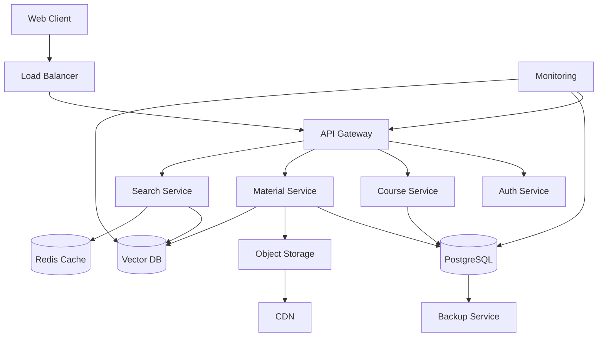
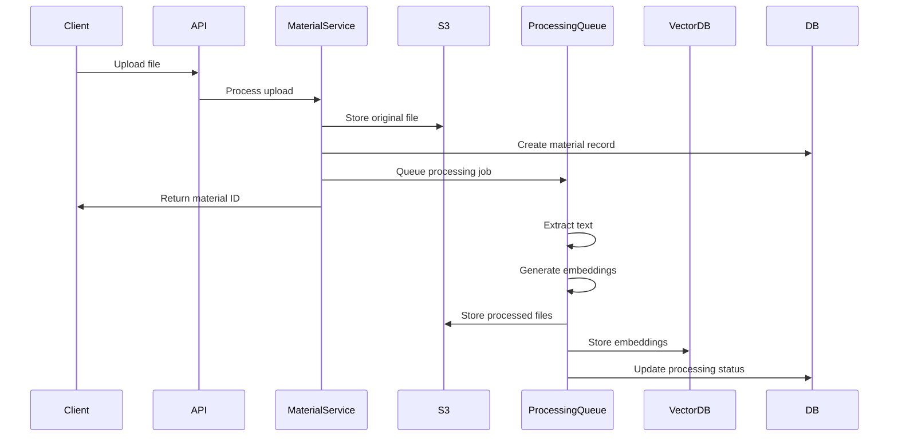

# Дизайн продакшн архитектуры данных

## Обзор

Продакшн архитектура для AI Tutor системы должна обеспечивать масштабируемость, надежность и высокую производительность для хранения курсов, learning materials и пользовательских данных.

## Архитектура

### Высокоуровневая диаграмма



## Компоненты

### 1. База данных PostgreSQL

**Основное хранилище для структурированных данных:**

```sql
-- Пользователи
CREATE TABLE users (
    id UUID PRIMARY KEY DEFAULT gen_random_uuid(),
    email VARCHAR(255) UNIQUE NOT NULL,
    name VARCHAR(255) NOT NULL,
    role VARCHAR(50) NOT NULL DEFAULT 'user',
    created_at TIMESTAMP DEFAULT NOW(),
    updated_at TIMESTAMP DEFAULT NOW()
);

-- Курсы
CREATE TABLE courses (
    id UUID PRIMARY KEY DEFAULT gen_random_uuid(),
    name VARCHAR(500) NOT NULL,
    description TEXT,
    creator_id UUID REFERENCES users(id),
    creator_role VARCHAR(50) NOT NULL,
    status VARCHAR(50) DEFAULT 'active',
    visibility VARCHAR(50) DEFAULT 'draft',
    language VARCHAR(10) DEFAULT 'en',
    level VARCHAR(50),
    skills JSONB DEFAULT '[]',
    llm_settings JSONB DEFAULT '{}',
    metadata JSONB DEFAULT '{}',
    created_at TIMESTAMP DEFAULT NOW(),
    updated_at TIMESTAMP DEFAULT NOW(),

    INDEX idx_courses_creator (creator_id),
    INDEX idx_courses_status (status),
    INDEX idx_courses_visibility (visibility),
    INDEX idx_courses_search (name, description)
);

-- AI Агенты
CREATE TABLE agents (
    id UUID PRIMARY KEY DEFAULT gen_random_uuid(),
    course_id UUID REFERENCES courses(id) ON DELETE CASCADE,
    name VARCHAR(255) NOT NULL,
    type VARCHAR(50) NOT NULL, -- 'course' | 'orchestration'
    instructions TEXT NOT NULL,
    configuration JSONB DEFAULT '{}',
    assigned_materials UUID[] DEFAULT '{}',
    metadata JSONB DEFAULT '{}',
    created_at TIMESTAMP DEFAULT NOW(),
    updated_at TIMESTAMP DEFAULT NOW(),

    INDEX idx_agents_course (course_id),
    INDEX idx_agents_type (type)
);

-- Материалы
CREATE TABLE materials (
    id UUID PRIMARY KEY DEFAULT gen_random_uuid(),
    course_id UUID REFERENCES courses(id) ON DELETE CASCADE,
    uploader_id UUID REFERENCES users(id),
    file_name VARCHAR(500) NOT NULL,
    file_type VARCHAR(100) NOT NULL,
    file_size BIGINT NOT NULL,
    file_path VARCHAR(1000) NOT NULL, -- путь в S3
    content_text TEXT, -- извлеченный текст
    content_hash VARCHAR(64), -- для дедупликации
    assignments JSONB DEFAULT '{}',
    processing_status VARCHAR(50) DEFAULT 'pending',
    processing_error TEXT,
    metadata JSONB DEFAULT '{}',
    created_at TIMESTAMP DEFAULT NOW(),
    updated_at TIMESTAMP DEFAULT NOW(),

    INDEX idx_materials_course (course_id),
    INDEX idx_materials_uploader (uploader_id),
    INDEX idx_materials_status (processing_status),
    INDEX idx_materials_hash (content_hash)
);

-- Векторные embeddings (метаданные)
CREATE TABLE embeddings (
    id UUID PRIMARY KEY DEFAULT gen_random_uuid(),
    material_id UUID REFERENCES materials(id) ON DELETE CASCADE,
    chunk_index INTEGER NOT NULL,
    chunk_text TEXT NOT NULL,
    vector_id VARCHAR(255) NOT NULL, -- ID в векторной БД
    metadata JSONB DEFAULT '{}',
    created_at TIMESTAMP DEFAULT NOW(),

    INDEX idx_embeddings_material (material_id),
    INDEX idx_embeddings_vector (vector_id)
);

-- Записи на курсы
CREATE TABLE enrollments (
    id UUID PRIMARY KEY DEFAULT gen_random_uuid(),
    user_id UUID REFERENCES users(id),
    course_id UUID REFERENCES courses(id),
    status VARCHAR(50) DEFAULT 'active',
    progress JSONB DEFAULT '{}',
    enrolled_at TIMESTAMP DEFAULT NOW(),
    updated_at TIMESTAMP DEFAULT NOW(),

    UNIQUE(user_id, course_id),
    INDEX idx_enrollments_user (user_id),
    INDEX idx_enrollments_course (course_id),
    INDEX idx_enrollments_status (status)
);

-- Сессии чата (существующая таблица расширена)
ALTER TABLE sessions ADD COLUMN course_id UUID REFERENCES courses(id);
ALTER TABLE sessions ADD INDEX idx_sessions_course (course_id);

-- Аудит изменений
CREATE TABLE audit_log (
    id UUID PRIMARY KEY DEFAULT gen_random_uuid(),
    table_name VARCHAR(100) NOT NULL,
    record_id UUID NOT NULL,
    action VARCHAR(50) NOT NULL, -- 'INSERT', 'UPDATE', 'DELETE'
    old_values JSONB,
    new_values JSONB,
    user_id UUID REFERENCES users(id),
    created_at TIMESTAMP DEFAULT NOW(),

    INDEX idx_audit_table_record (table_name, record_id),
    INDEX idx_audit_user (user_id),
    INDEX idx_audit_created (created_at)
);
```

### 2. Object Storage (S3-совместимое)

**Хранение файлов и медиа:**

```
Структура bucket'ов:
├── materials/
│   ├── {course_id}/
│   │   ├── {material_id}/
│   │   │   ├── original.{ext}     # Оригинальный файл
│   │   │   ├── processed.txt      # Извлеченный текст
│   │   │   ├── thumbnail.jpg      # Превью (для изображений/PDF)
│   │   │   └── metadata.json      # Дополнительные метаданные
│   │   └── ...
│   └── ...
├── backups/
│   ├── daily/
│   ├── weekly/
│   └── monthly/
└── temp/
    └── uploads/                   # Временные файлы загрузки
```

**Политики доступа:**

- Публичное чтение для опубликованных материалов
- Приватный доступ для черновиков
- Подписанные URL для временного доступа
- Автоматическое удаление временных файлов

### 3. Векторная база данных

**Выбор: Qdrant или Weaviate**

```python
# Схема для Qdrant
{
    "vectors": {
        "size": 1536,  # OpenAI ada-002 или аналог
        "distance": "Cosine"
    },
    "payload": {
        "material_id": "string",
        "course_id": "string",
        "chunk_index": "integer",
        "text": "string",
        "metadata": "object"
    }
}
```

**Индексирование:**

- Автоматическое создание embeddings при загрузке материалов
- Chunking текста на фрагменты 500-1000 токенов
- Batch обработка для производительности
- Инкрементальное обновление при изменениях

### 4. Кэширование (Redis)

**Стратегии кэширования:**

```redis
# Кэш курсов
courses:{user_id} -> JSON курсов пользователя (TTL: 1h)
course:{course_id} -> JSON данных курса (TTL: 30m)

# Кэш материалов
materials:{course_id} -> JSON списка материалов (TTL: 15m)
material:{material_id} -> JSON данных материала (TTL: 1h)

# Кэш поиска
search:{query_hash} -> JSON результатов поиска (TTL: 5m)

# Кэш сессий
session:{session_id} -> JSON данных сессии (TTL: 24h)

# Кэш пользователей
user:{user_id} -> JSON данных пользователя (TTL: 1h)
```

### 5. API Gateway и сервисы

**Микросервисная архитектура:**

```typescript
// Course Service
interface CourseService {
  createCourse(data: CourseData): Promise<Course>;
  updateCourse(id: string, data: Partial<CourseData>): Promise<Course>;
  deleteCourse(id: string): Promise<void>;
  getCourse(id: string): Promise<Course>;
  listCourses(filters: CourseFilters): Promise<Course[]>;
  searchCourses(query: string): Promise<Course[]>;
}

// Material Service
interface MaterialService {
  uploadMaterial(file: File, courseId: string): Promise<Material>;
  processMaterial(materialId: string): Promise<void>;
  deleteMaterial(materialId: string): Promise<void>;
  getMaterial(id: string): Promise<Material>;
  listMaterials(courseId: string): Promise<Material[]>;
}

// Search Service
interface SearchService {
  semanticSearch(query: string, courseId?: string): Promise<SearchResult[]>;
  textSearch(query: string, filters: SearchFilters): Promise<SearchResult[]>;
  indexMaterial(materialId: string): Promise<void>;
  reindexCourse(courseId: string): Promise<void>;
}
```

## Обработка файлов

### Pipeline обработки материалов



### Поддерживаемые форматы

- **Документы:** PDF, DOC, DOCX, TXT, MD
- **Изображения:** JPG, PNG, GIF, WEBP (с OCR)
- **Аудио:** MP3, WAV, M4A (с транскрипцией)
- **Видео:** MP4, WEBM (извлечение аудио + транскрипция)
- **Презентации:** PPT, PPTX (извлечение текста и изображений)

## Безопасность

### Аутентификация и авторизация

```typescript
// JWT токены с ролями
interface JWTPayload {
  userId: string;
  email: string;
  role: 'admin' | 'user';
  permissions: string[];
  exp: number;
}

// RBAC система
const permissions = {
  'course.create': ['admin', 'user'],
  'course.update.own': ['admin', 'user'],
  'course.update.any': ['admin'],
  'course.delete.own': ['admin', 'user'],
  'course.delete.any': ['admin'],
  'material.upload': ['admin', 'user'],
  'material.delete.own': ['admin', 'user'],
  'material.delete.any': ['admin']
};
```

### Защита данных

- Шифрование в покое (AES-256)
- Шифрование в транзите (TLS 1.3)
- Подписанные URL для доступа к файлам
- Rate limiting для API
- Input validation и sanitization
- SQL injection защита через ORM

## Мониторинг и метрики

### Ключевые метрики

```typescript
interface SystemMetrics {
  // Производительность
  apiResponseTime: number; // P95 < 500ms
  dbQueryTime: number; // P95 < 100ms
  fileUploadTime: number; // P95 < 30s для 10MB
  searchResponseTime: number; // P95 < 200ms

  // Использование
  activeUsers: number;
  coursesCreated: number;
  materialsUploaded: number;
  searchQueries: number;

  // Ресурсы
  cpuUsage: number; // < 70%
  memoryUsage: number; // < 80%
  diskUsage: number; // < 85%
  networkIO: number;

  // Ошибки
  errorRate: number; // < 1%
  failedUploads: number;
  processingErrors: number;
}
```

### Алерты

- API response time > 1s
- Error rate > 5%
- Database connections > 80%
- Disk usage > 90%
- Failed backups
- Vector DB unavailable

## Масштабирование

### Горизонтальное масштабирование

- **API сервисы:** Stateless, автоскейлинг по CPU/памяти
- **База данных:** Read replicas, connection pooling
- **Векторная БД:** Sharding по курсам
- **Object Storage:** Автоматическое масштабирование
- **Кэш:** Redis Cluster

### Вертикальное масштабирование

- **Начальная конфигурация:**
  - API: 2 CPU, 4GB RAM
  - DB: 4 CPU, 16GB RAM, 500GB SSD
  - Vector DB: 8 CPU, 32GB RAM, 1TB SSD
  - Redis: 2 CPU, 8GB RAM

- **Масштабирование по нагрузке:**
  - 1K пользователей: базовая конфигурация
  - 10K пользователей: удвоение ресурсов
  - 100K пользователей: кластерная архитектура

## Резервное копирование

### Стратегия бэкапов

- **PostgreSQL:**
  - Ежедневные полные бэкапы
  - Непрерывная репликация WAL
  - Point-in-time recovery до 30 дней

- **Object Storage:**
  - Версионирование файлов
  - Cross-region репликация
  - Lifecycle policies для архивирования

- **Vector DB:**
  - Ежедневные снапшоты
  - Инкрементальные бэкапы
  - Возможность полной переиндексации

### Disaster Recovery

- **RTO (Recovery Time Objective):** < 30 минут
- **RPO (Recovery Point Objective):** < 5 минут
- **Автоматический failover** для критических сервисов
- **Географически распределенные бэкапы**

## Миграция с текущей системы

### Этапы миграции

1. **Подготовка инфраструктуры** (2 недели)
2. **Миграция пользователей и сессий** (1 неделя)
3. **Миграция курсов из localStorage** (1 неделя)
4. **Обработка и индексация материалов** (2 недели)
5. **Тестирование и оптимизация** (1 неделя)
6. **Переключение на продакшн** (1 день)

### Скрипт миграции

```typescript
interface MigrationScript {
  exportFromLocalStorage(): LocalStorageData;
  validateData(data: LocalStorageData): ValidationResult;
  transformToNewSchema(data: LocalStorageData): DatabaseData;
  importToDatabase(data: DatabaseData): Promise<void>;
  verifyMigration(): Promise<boolean>;
}
```
