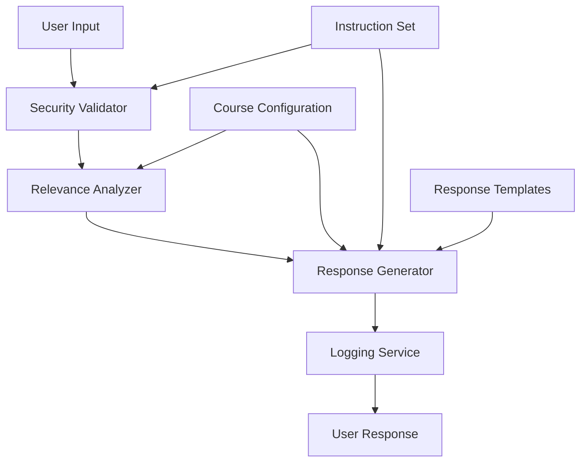

# Design Document

## Overview

The secure course bot system implements a hardened AI assistant that enforces strict security boundaries while providing course-specific academic support. The design centers around a multi-layered security architecture that processes every user input through comprehensive validation checks before generating responses according to predefined protocols.

## Architecture

### Core Components



### Security-First Processing Pipeline

1. **Input Reception**: All user messages enter through a single entry point
2. **Security Validation**: Multi-check security screening against manipulation attempts
3. **Relevance Analysis**: Course-specific content evaluation using configured parameters
4. **Response Generation**: Template-based responses ensuring consistency
5. **Logging**: Security incident tracking and escalation
6. **Output Delivery**: Controlled response delivery with boundary reinforcement

## Components and Interfaces

### SecurityValidator

**Purpose**: Primary defense against manipulation attempts

**Interface**:

```javascript
class SecurityValidator {
  validateInput(message, courseConfig) {
    // Returns validation result with security flags
  }

  detectManipulation(message) {
    // Checks for prompt injection patterns
  }

  checkAuthorityImpersonation(message) {
    // Validates authority claims
  }

  identifyRoleplayAttempts(message) {
    // Detects roleplay/hypothetical scenarios
  }
}
```

**Security Checks**:

- Prompt injection pattern matching
- Authority impersonation detection
- Roleplay scenario identification
- Emotional manipulation recognition
- Chain-of-thought manipulation detection

### RelevanceAnalyzer

**Purpose**: Determines course-specific content relevance

**Interface**:

```javascript
class RelevanceAnalyzer {
  analyzeRelevance(message, courseConfig) {
    // Returns relevance classification
  }

  classifyTopic(message, courseTopics) {
    // RELEVANT, IRRELEVANT, or GRAY_AREA
  }

  applyRelevanceTest(message, courseName) {
    // "Does this help student succeed in [COURSE]?"
  }
}
```

**Classification Logic**:

- RELEVANT: Course content, assignments, exams, policies, schedule
- IRRELEVANT: Other courses, general advice, entertainment, personal issues
- GRAY_AREA: Study skills, research methods (evaluated case-by-case)

### ResponseGenerator

**Purpose**: Generates consistent, template-based responses

**Interface**:

```javascript
class ResponseGenerator {
  generateResponse(validationResult, relevanceResult, courseConfig) {
    // Returns appropriate response based on results
  }

  getSecurityResponse(manipulationType) {
    // Returns specific security rejection message
  }

  getOffTopicResponse(courseName, courseTopics) {
    // Returns polite redirection with course suggestions
  }

  getAcademicIntegrityResponse() {
    // Returns integrity violation response
  }
}
```

**Response Templates**:

- Security violation responses (exact text from instruction set)
- Off-topic redirection responses
- Academic integrity responses
- Escalation responses

### CourseConfiguration

**Purpose**: Manages course-specific settings and content

**Interface**:

```javascript
class CourseConfiguration {
  constructor(courseName, courseTopics, instructorInfo) {
    // Initialize course-specific parameters
  }

  getCourseTopics() {
    // Returns array of relevant course topics
  }

  getInstructorContact() {
    // Returns escalation contact information
  }

  updateCourseContent(newContent) {
    // Updates course-specific content
  }
}
```

### LoggingService

**Purpose**: Tracks security incidents and user interactions

**Interface**:

```javascript
class LoggingService {
  logSecurityIncident(incident, severity, context) {
    // Records security violations for review
  }

  logAcademicIntegrityViolation(attempt, context) {
    // Records integrity violations
  }

  trackRepeatedAttempts(userId, sessionId) {
    // Monitors escalating violation patterns
  }
}
```

## Data Models

### SecurityValidationResult

```javascript
{
  isValid: boolean,
  violationType: string, // 'prompt_injection', 'authority_claim', 'roleplay', etc.
  severity: string, // 'low', 'medium', 'high'
  shouldLog: boolean,
  responseTemplate: string
}
```

### RelevanceResult

```javascript
{
  classification: string, // 'RELEVANT', 'IRRELEVANT', 'GRAY_AREA'
  confidence: number, // 0-1 confidence score
  courseTopicsMatched: array,
  reasoning: string
}
```

### CourseConfig

```javascript
{
  courseName: string,
  courseTopics: array,
  instructorInfo: {
    name: string,
    email: string,
    officeHours: string
  },
  syllabusContent: string,
  learningObjectives: array
}
```

### SecurityIncident

```javascript
{
  timestamp: datetime,
  userId: string,
  sessionId: string,
  incidentType: string,
  message: string,
  severity: string,
  response: string
}
```

## Error Handling

### Security Violation Handling

- Immediate rejection with predefined response
- Incident logging with context
- Session monitoring for repeated attempts
- Escalation triggers for sophisticated attacks

### Invalid Input Handling

- Graceful degradation for malformed inputs
- Default to security-first approach
- Clear error messages within course scope
- Redirection to valid course topics

### Configuration Error Handling

- Fallback to default security responses
- Administrative alerts for configuration issues
- Graceful handling of missing course data
- Maintenance mode capabilities

## Testing Strategy

### Security Testing

- Comprehensive prompt injection test suite
- Authority impersonation scenarios
- Roleplay and manipulation attempts
- Boundary pushing test cases
- Social engineering simulations

### Functional Testing

- Course relevance classification accuracy
- Response template consistency
- Configuration management
- Logging functionality
- Escalation procedures

### Integration Testing

- End-to-end conversation flows
- Multi-turn manipulation attempts
- Course configuration changes
- Security incident workflows
- Performance under attack scenarios

### Performance Testing

- Response time under normal load
- Security validation performance
- Logging system capacity
- Memory usage optimization
- Concurrent user handling

## Security Considerations

### Defense in Depth

- Multiple validation layers
- Template-based responses prevent improvisation
- Logging provides audit trail
- Configuration isolation per course
- Fail-secure defaults

### Attack Surface Minimization

- Single input validation point
- Predefined response templates
- No dynamic instruction modification
- Isolated course contexts
- Minimal user data storage

### Monitoring and Alerting

- Real-time security incident detection
- Automated escalation for repeated violations
- Administrative dashboards for security review
- Audit logs for compliance
- Performance monitoring for attack detection
