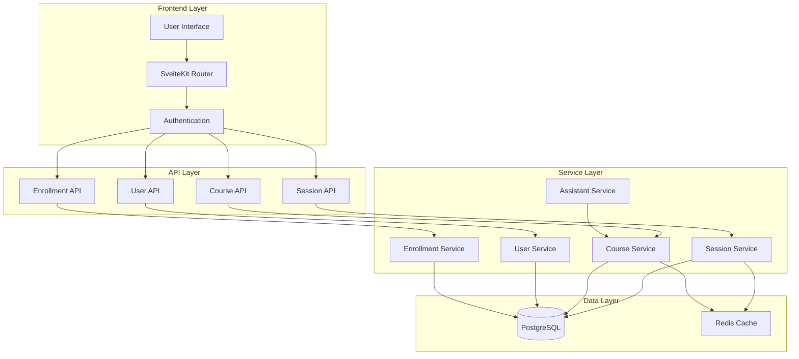
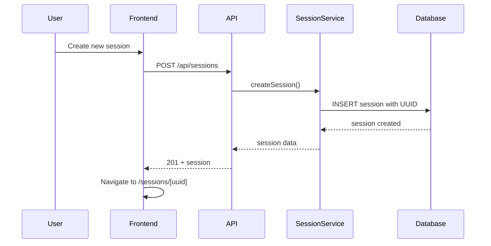
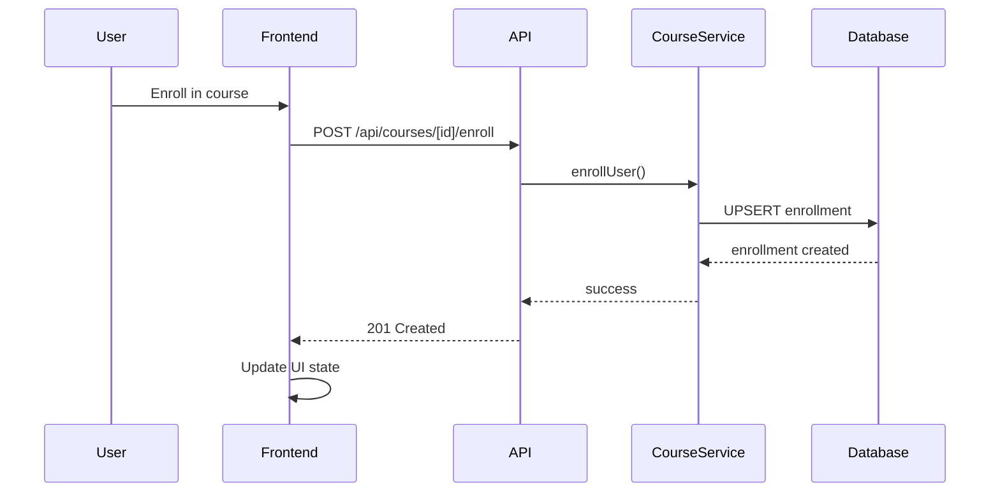

# Design Document

## Overview

Данный документ описывает архитектурное решение для реструктуризации системы управления сессиями, унификации терминологии и внедрения системы управления курсами с подписками. Дизайн обеспечивает мягкое удаление сессий, уникальные URL, разграничение прав доступа и полную обратную совместимость.

## Architecture

### High-Level Architecture



### User Flow Architecture

```mermaid
graph TD
    Start[User visits /] --> LoginCheck{Authenticated?}
    LoginCheck -->|No| LoginPage[/login]
    LoginCheck -->|Yes| SessionsPage[/sessions]
    
    LoginPage --> AuthSuccess{Auth Success?}
    AuthSuccess -->|Yes| SessionsPage
    AuthSuccess -->|No| LoginPage
    
    SessionsPage --> ModeCheck{Mode?}
    ModeCheck -->|FUN| FunSessions[Simple List View]
    ModeCheck -->|LEARN| LearnSessions[Course-Grouped View]
    
    FunSessions --> SessionSelect[Select Session]
    LearnSessions --> CourseSelect[Select Course]
    CourseSelect --> SessionSelect
    
    SessionSelect --> SessionView[/sessions/[uuid]]
```

## Components and Interfaces

### 1. Database Schema Extensions

#### Updated Session Model
```prisma
model Session {
  id           String    @id @default(cuid())
  userId       String    @map("user_id")
  courseId     String?   @map("course_id") // New: Link to course in LEARN mode
  title        String    @db.VarChar(500)
  preview      String?   @db.Text
  language     String    @default("en") @db.VarChar(10)
  mode         String    @default("fun") @db.VarChar(20) // 'fun' or 'learn'
  isHidden     Boolean   @default(false) @map("is_hidden") // New: Soft delete
  createdAt    DateTime  @default(now()) @map("created_at")
  updatedAt    DateTime  @updatedAt @map("updated_at")
  messageCount Int       @default(0) @map("message_count")
  
  // Relations
  messages     Message[]
  user         User      @relation(fields: [userId], references: [id])
  course       Course?   @relation(fields: [courseId], references: [id])
  
  // Indexes
  @@index([userId, updatedAt(sort: Desc)], name: "idx_user_sessions")
  @@index([courseId, updatedAt(sort: Desc)], name: "idx_course_sessions")
  @@index([title, preview], name: "idx_session_search")
  @@index([isHidden], name: "idx_session_visibility")
  @@map("sessions")
}
```

#### New User Model
```prisma
model User {
  id        String   @id @default(cuid())
  email     String   @unique
  name      String
  role      UserRole @default(USER)
  createdAt DateTime @default(now()) @map("created_at")
  updatedAt DateTime @updatedAt @map("updated_at")
  
  // Relations
  sessions     Session[]
  createdCourses Course[] @relation("CourseCreator")
  enrollments  Enrollment[]
  
  @@map("users")
}

enum UserRole {
  USER
  ADMIN
}
```

#### New Course Model
```prisma
model Course {
  id          String   @id @default(cuid())
  name        String   @db.VarChar(200)
  description String   @db.Text
  creatorId   String   @map("creator_id")
  status      CourseStatus @default(ACTIVE)
  visibility  CourseVisibility @default(DRAFT)
  language    String   @default("en") @db.VarChar(10)
  level       String?  @db.VarChar(50)
  skills      String[] // Array of skills
  createdAt   DateTime @default(now()) @map("created_at")
  updatedAt   DateTime @updatedAt @map("updated_at")
  
  // Relations
  creator     User     @relation("CourseCreator", fields: [creatorId], references: [id])
  sessions    Session[]
  enrollments Enrollment[]
  assistants  Assistant[]
  
  @@index([creatorId], name: "idx_course_creator")
  @@index([status, visibility], name: "idx_course_access")
  @@map("courses")
}

enum CourseStatus {
  ACTIVE
  BLOCKED
  DELETED
}

enum CourseVisibility {
  DRAFT
  PRIVATE
  PUBLISHED
}
```

#### New Enrollment Model
```prisma
model Enrollment {
  id        String   @id @default(cuid())
  userId    String   @map("user_id")
  courseId  String   @map("course_id")
  status    EnrollmentStatus @default(ACTIVE)
  enrolledAt DateTime @default(now()) @map("enrolled_at")
  droppedAt  DateTime? @map("dropped_at")
  
  // Relations
  user      User     @relation(fields: [userId], references: [id])
  course    Course   @relation(fields: [courseId], references: [id])
  
  @@unique([userId, courseId])
  @@index([userId, status], name: "idx_user_enrollments")
  @@index([courseId, status], name: "idx_course_enrollments")
  @@map("enrollments")
}

enum EnrollmentStatus {
  ACTIVE
  DROPPED
}
```

#### New Assistant Model
```prisma
model Assistant {
  id           String   @id @default(cuid())
  name         String   @db.VarChar(200)
  instructions String   @db.Text
  courseId     String   @map("course_id")
  type         AssistantType @default(COURSE)
  configuration Json    // LLM settings
  createdAt    DateTime @default(now()) @map("created_at")
  updatedAt    DateTime @updatedAt @map("updated_at")
  
  // Relations
  course       Course   @relation(fields: [courseId], references: [id])
  
  @@index([courseId], name: "idx_course_assistants")
  @@map("assistants")
}

enum AssistantType {
  COURSE
  ORCHESTRATION
}
```

### 2. API Endpoints

#### Session Management API
```typescript
// GET /api/sessions - List user sessions
interface SessionListResponse {
  sessions: Session[];
  pagination: {
    total: number;
    page: number;
    limit: number;
  };
}

// GET /api/sessions/[id] - Get specific session
interface SessionResponse {
  session: Session;
  messages: Message[];
}

// POST /api/sessions - Create new session
interface CreateSessionRequest {
  title: string;
  mode: 'fun' | 'learn';
  courseId?: string; // Required for LEARN mode
  language?: string;
}

// PATCH /api/sessions/[id] - Update session
interface UpdateSessionRequest {
  title?: string;
  isHidden?: boolean; // For soft delete
}

// DELETE /api/sessions/[id] - Soft delete session (user only)
// Returns 204 No Content
```

#### Course Management API
```typescript
// GET /api/courses - List available courses
interface CourseListResponse {
  courses: Course[];
  pagination: {
    total: number;
    page: number;
    limit: number;
  };
}

// POST /api/courses - Create new course
interface CreateCourseRequest {
  name: string;
  description: string;
  visibility: 'draft' | 'private' | 'published';
  language?: string;
  level?: string;
  skills?: string[];
}

// GET /api/courses/[id] - Get course details
interface CourseResponse {
  course: Course;
  assistants: Assistant[];
  isEnrolled: boolean;
}
```

#### Enrollment API
```typescript
// POST /api/courses/[id]/enroll - Enroll in course
// Returns 201 Created

// DELETE /api/courses/[id]/enroll - Drop from course
// Returns 204 No Content

// GET /api/users/me/enrollments - Get user enrollments
interface EnrollmentListResponse {
  enrollments: Array<{
    id: string;
    course: Course;
    enrolledAt: string;
    status: 'active' | 'dropped';
  }>;
}
```

### 3. Frontend Components

#### Router Configuration
```typescript
// src/routes/+layout.server.js
export async function load({ locals, url }) {
  // Redirect root to login if not authenticated
  if (url.pathname === '/' && !locals.user) {
    throw redirect(302, '/login');
  }
  
  // Redirect to sessions if authenticated and on root
  if (url.pathname === '/' && locals.user) {
    throw redirect(302, '/sessions');
  }
  
  return {
    user: locals.user
  };
}
```

#### Session List Component
```svelte
<!-- src/routes/sessions/+page.svelte -->
<script>
  import { page } from '$app/stores';
  import { mode } from '$lib/stores/mode.js';
  import SessionCard from '$lib/components/SessionCard.svelte';
  import CourseGroup from '$lib/components/CourseGroup.svelte';
  
  export let data;
  
  $: sessions = data.sessions;
  $: courses = data.courses;
  $: groupedSessions = groupSessionsByCourse(sessions, courses);
  
  function groupSessionsByCourse(sessions, courses) {
    if ($mode === 'fun') {
      return { ungrouped: sessions };
    }
    
    // Group by course for LEARN mode
    const grouped = {};
    courses.forEach(course => {
      grouped[course.id] = {
        course,
        sessions: sessions.filter(s => s.courseId === course.id)
      };
    });
    
    return grouped;
  }
</script>

{#if $mode === 'fun'}
  <div class="sessions-list">
    {#each sessions as session}
      <SessionCard {session} showDeleteButton={true} />
    {/each}
  </div>
{:else}
  <div class="courses-list">
    {#each Object.values(groupedSessions) as group}
      <CourseGroup course={group.course} sessions={group.sessions} />
    {/each}
  </div>
{/if}
```

#### Session Component with UUID routing
```svelte
<!-- src/routes/sessions/[id]/+page.svelte -->
<script>
  import { page } from '$app/stores';
  import ChatInterface from '$lib/components/ChatInterface.svelte';
  import { goto } from '$app/navigation';
  
  export let data;
  
  $: session = data.session;
  $: messages = data.messages;
  $: assistant = data.assistant;
  
  // Handle session not found or access denied
  if (!session) {
    goto('/sessions');
  }
</script>

<ChatInterface {session} {messages} {assistant} />
```

### 4. Service Layer

#### Session Service
```typescript
// src/lib/services/SessionService.js
export class SessionService {
  async createSession(userId, sessionData) {
    const session = await prisma.session.create({
      data: {
        ...sessionData,
        userId,
        id: crypto.randomUUID()
      }
    });
    
    return session;
  }
  
  async getUserSessions(userId, includeHidden = false) {
    const where = { userId };
    if (!includeHidden) {
      where.isHidden = false;
    }
    
    return await prisma.session.findMany({
      where,
      orderBy: { updatedAt: 'desc' },
      include: {
        course: true
      }
    });
  }
  
  async softDeleteSession(sessionId, userId) {
    // Verify ownership
    const session = await prisma.session.findFirst({
      where: { id: sessionId, userId }
    });
    
    if (!session) {
      throw new Error('Session not found or access denied');
    }
    
    return await prisma.session.update({
      where: { id: sessionId },
      data: { isHidden: true }
    });
  }
  
  async getSessionById(sessionId, userId, isAdmin = false) {
    const where = { id: sessionId };
    
    if (!isAdmin) {
      where.userId = userId;
      where.isHidden = false;
    }
    
    return await prisma.session.findFirst({
      where,
      include: {
        messages: true,
        course: {
          include: {
            assistants: true
          }
        }
      }
    });
  }
}
```

#### Course Service
```typescript
// src/lib/services/CourseService.js
export class CourseService {
  async createCourse(creatorId, courseData) {
    return await prisma.course.create({
      data: {
        ...courseData,
        creatorId,
        id: crypto.randomUUID()
      }
    });
  }
  
  async getAvailableCourses(userId) {
    return await prisma.course.findMany({
      where: {
        OR: [
          { visibility: 'published' },
          { creatorId: userId },
          {
            enrollments: {
              some: {
                userId,
                status: 'ACTIVE'
              }
            }
          }
        ],
        status: 'ACTIVE'
      },
      include: {
        creator: true,
        _count: {
          select: {
            enrollments: {
              where: { status: 'ACTIVE' }
            }
          }
        }
      }
    });
  }
  
  async enrollUser(userId, courseId) {
    return await prisma.enrollment.upsert({
      where: {
        userId_courseId: { userId, courseId }
      },
      update: {
        status: 'ACTIVE',
        droppedAt: null
      },
      create: {
        userId,
        courseId,
        status: 'ACTIVE'
      }
    });
  }
  
  async dropUser(userId, courseId) {
    return await prisma.enrollment.update({
      where: {
        userId_courseId: { userId, courseId }
      },
      data: {
        status: 'DROPPED',
        droppedAt: new Date()
      }
    });
  }
}
```

## Data Models

### Session Data Flow


### Course Enrollment Flow


## Error Handling

### Session Access Control
```typescript
// Middleware for session access
export async function validateSessionAccess(sessionId, userId, isAdmin = false) {
  const session = await prisma.session.findFirst({
    where: { id: sessionId }
  });
  
  if (!session) {
    throw new Error('Session not found', { status: 404 });
  }
  
  if (!isAdmin && session.userId !== userId) {
    throw new Error('Access denied', { status: 403 });
  }
  
  if (!isAdmin && session.isHidden) {
    throw new Error('Session not available', { status: 410 });
  }
  
  return session;
}
```

### Course Access Control
```typescript
// Check if user can access course
export async function validateCourseAccess(courseId, userId) {
  const course = await prisma.course.findFirst({
    where: { id: courseId },
    include: {
      enrollments: {
        where: { userId, status: 'ACTIVE' }
      }
    }
  });
  
  if (!course) {
    throw new Error('Course not found', { status: 404 });
  }
  
  const hasAccess = 
    course.visibility === 'published' ||
    course.creatorId === userId ||
    course.enrollments.length > 0;
  
  if (!hasAccess) {
    throw new Error('Course access denied', { status: 403 });
  }
  
  return course;
}
```

## Testing Strategy

### Unit Tests
- Session service methods (create, list, soft delete, access control)
- Course service methods (create, enroll, drop, access control)
- API endpoint handlers
- Frontend component logic

### Integration Tests
- Complete user flows (login → sessions → chat)
- Course enrollment/drop workflows
- Session creation in different modes
- Admin access to hidden sessions

### E2E Tests
- User journey from login to chat
- Session management across modes
- Course discovery and enrollment
- Soft delete functionality

### Migration Tests
- Terminology migration (subject → course)
- Database schema updates
- Backward compatibility validation

## Performance Considerations

### Database Optimization
- Proper indexing on session queries (userId, courseId, isHidden)
- Pagination for large session lists
- Efficient course filtering queries
- Connection pooling for high concurrency

### Caching Strategy
- Redis cache for frequently accessed courses
- Session metadata caching
- User enrollment status caching
- Cache invalidation on updates

### Frontend Optimization
- Lazy loading of session messages
- Virtual scrolling for large session lists
- Optimistic updates for enrollment actions
- Efficient state management with Svelte stores