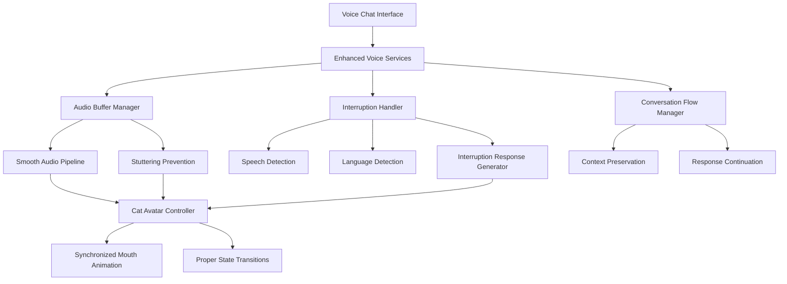

# Design Document

## Overview

This design addresses critical UX issues in the voice mode to create more natural, human-like conversations. The solution focuses on three main areas: eliminating audio stuttering during waiting phrases, ensuring proper mouth animation synchronization, and implementing intelligent interruption handling with multilingual support.

The design builds upon the existing voice services architecture while introducing new components for audio buffering, interruption detection, and conversational flow management.

## Architecture

### Current System Analysis

Based on the existing codebase, the voice system consists of:

- **VoiceServices**: Main orchestrator for voice interactions
- **WaitingPhrasesService**: Manages phrase selection and caching
- **CatAvatar**: Handles visual mouth animations with lip-sync
- **Audio Queue System**: Manages audio playback priorities
- **Translation Bridge**: Handles multilingual phrase translation

### Enhanced Architecture



## Components and Interfaces

### 1. Audio Buffer Manager

**Purpose**: Eliminate stuttering by implementing proper audio buffering and smooth transitions.

```javascript
class AudioBufferManager {
  constructor() {
    this.bufferSize = 4096; // Increased buffer size
    this.preloadBuffer = new Map(); // Pre-loaded audio chunks
    this.smoothingWindow = 150; // ms for smooth transitions
  }

  async bufferAudio(audioBlob, metadata) {
    // Pre-process audio for smooth playback
    // Implement crossfading between audio segments
    // Add silence padding to prevent abrupt cuts
  }

  async playWithSmoothing(audioData) {
    // Implement smooth audio transitions
    // Use Web Audio API for precise timing
    // Apply fade-in/fade-out effects
  }
}
```

**Key Features**:

- Pre-loading and buffering of waiting phrase audio
- Crossfading between audio segments
- Silence padding to prevent abrupt transitions
- Real-time audio processing for smooth playback

### 2. Interruption Detection System

**Purpose**: Detect when users want to interrupt the bot and handle it gracefully.

```javascript
class InterruptionDetector {
  constructor() {
    this.isListening = false;
    this.speechThreshold = 0.1; // Amplitude threshold for speech detection
    this.interruptionTimeout = 500; // ms to confirm interruption intent
    this.languageDetector = new LanguageDetector();
  }

  startListening() {
    // Monitor microphone input while bot is speaking
    // Detect speech patterns that indicate interruption
    // Use voice activity detection (VAD)
  }

  async detectInterruption(audioStream) {
    // Analyze incoming audio for speech patterns
    // Distinguish between background noise and intentional speech
    // Return interruption confidence level
  }

  async detectLanguage(audioBuffer) {
    // Analyze audio characteristics for language detection
    // Use phonetic patterns and prosody analysis
    // Return detected language with confidence score
  }
}
```

**Key Features**:

- Real-time voice activity detection during bot speech
- Language detection from interrupting speech
- Confidence scoring for interruption intent
- Background noise filtering

### 3. Conversation Flow Manager

**Purpose**: Manage conversation state and provide natural interruption responses.

```javascript
class ConversationFlowManager {
  constructor() {
    this.currentResponse = null;
    this.interruptionPoint = null;
    this.conversationContext = new Map();
    this.responseGenerator = new InterruptionResponseGenerator();
  }

  async handleInterruption(detectedLanguage, interruptionContext) {
    // Pause current response at natural boundary
    // Generate appropriate interruption acknowledgment
    // Offer continuation or new topic options
  }

  async generateInterruptionResponse(language, context) {
    // Create contextually appropriate interruption phrases
    // Localize responses to detected language
    // Maintain conversational tone
  }

  preserveResponseContext(currentResponse, interruptionPoint) {
    // Save current response state for potential continuation
    // Mark interruption point for seamless resumption
    // Store conversation context
  }
}
```

**Key Features**:

- Context-aware interruption handling
- Multilingual interruption responses
- Response continuation management
- Natural conversation flow preservation

### 4. Enhanced Avatar Controller

**Purpose**: Ensure proper mouth animation synchronization and state management.

```javascript
class EnhancedAvatarController {
  constructor() {
    this.animationState = 'neutral';
    this.transitionManager = new AnimationTransitionManager();
    this.lipSyncEngine = new ImprovedLipSyncEngine();
  }

  async synchronizeWithAudio(audioData, metadata) {
    // Analyze audio for precise lip-sync timing
    // Ensure mouth closes properly at audio end
    // Handle interruption animations smoothly
  }

  async transitionToState(newState, duration = 300) {
    // Smooth transitions between animation states
    // Prevent abrupt mouth position changes
    // Handle interruption-specific animations
  }
}
```

**Key Features**:

- Improved lip-sync accuracy with audio analysis
- Proper mouth closure at speech end
- Smooth state transitions
- Interruption-aware animations

## Data Models

### Audio Buffer Data

```javascript
interface AudioBufferData {
  id: string;
  audioBlob: Blob;
  metadata: {
    isWaitingPhrase: boolean;
    language: string;
    duration: number;
    priority: number;
    bufferSize: number;
    crossfadePoints: number[];
  };
  processingInfo: {
    buffered: boolean;
    smoothed: boolean;
    fadingApplied: boolean;
  };
}
```

### Interruption Event

```javascript
interface InterruptionEvent {
  timestamp: number;
  detectedLanguage: string;
  confidence: number;
  audioBuffer: ArrayBuffer;
  interruptionPoint: {
    responseId: string;
    wordIndex: number;
    timeOffset: number;
  };
  context: {
    currentTopic: string;
    responseType: 'waiting_phrase' | 'main_response';
    userIntent: 'question' | 'clarification' | 'new_topic';
  };
}
```

### Conversation State

```javascript
interface ConversationState {
  currentResponse: {
    id: string;
    text: string;
    language: string;
    startTime: number;
    estimatedDuration: number;
  };
  interruptionHistory: InterruptionEvent[];
  contextStack: Array<{
    topic: string;
    responses: string[];
    timestamp: number;
  }>;
  userPreferences: {
    preferredLanguage: string;
    interruptionSensitivity: 'low' | 'medium' | 'high';
    responseStyle: 'brief' | 'detailed';
  };
}
```

## Error Handling

### Audio Processing Errors

```javascript
class AudioErrorHandler {
  async handleBufferingError(error, audioData) {
    // Fallback to direct playback without buffering
    // Log error details for debugging
    // Notify user if audio quality is affected
  }

  async handleSynthesisError(error, text, language) {
    // Retry with simplified text
    // Fallback to different TTS voice
    // Use text-only response as last resort
  }
}
```

### Interruption Detection Errors

```javascript
class InterruptionErrorHandler {
  async handleDetectionFailure(error) {
    // Continue with current response
    // Log detection failure for analysis
    // Adjust sensitivity parameters
  }

  async handleLanguageDetectionError(error, audioBuffer) {
    // Fallback to user's preferred language
    // Use previous conversation language
    // Default to English as last resort
  }
}
```

### Network and Latency Issues

```javascript
class NetworkErrorHandler {
  async handleSynthesisTimeout(request) {
    // Use cached audio if available
    // Simplify text for faster synthesis
    // Provide user feedback about delays
  }

  async handleTranslationFailure(text, targetLanguage) {
    // Use original language
    // Try alternative translation service
    // Cache failure to avoid retries
  }
}
```

## Testing Strategy

### Unit Tests

1. **Audio Buffer Manager Tests**
   - Buffer creation and management
   - Crossfading algorithms
   - Smooth transition timing

2. **Interruption Detection Tests**
   - Voice activity detection accuracy
   - Language detection precision
   - False positive/negative rates

3. **Conversation Flow Tests**
   - Context preservation
   - Response generation
   - State management

### Integration Tests

1. **End-to-End Voice Flow**
   - Complete conversation scenarios
   - Interruption handling workflows
   - Multi-language conversations

2. **Avatar Synchronization**
   - Lip-sync accuracy
   - State transition smoothness
   - Animation timing

3. **Performance Tests**
   - Audio processing latency
   - Memory usage optimization
   - Real-time processing capabilities

### User Experience Tests

1. **Stuttering Prevention**
   - Audio quality assessment
   - Smooth playback verification
   - Transition seamlessness

2. **Interruption Naturalness**
   - Response appropriateness
   - Language accuracy
   - Conversation flow quality

3. **Avatar Behavior**
   - Mouth animation accuracy
   - Proper state transitions
   - Visual synchronization

## Implementation Phases

### Phase 1: Audio Stuttering Fix

- Implement AudioBufferManager
- Add crossfading capabilities
- Enhance audio preprocessing
- Fix mouth animation synchronization

### Phase 2: Interruption Detection

- Build InterruptionDetector
- Implement voice activity detection
- Add language detection capabilities
- Create basic interruption responses

### Phase 3: Conversation Flow Enhancement

- Develop ConversationFlowManager
- Implement context preservation
- Add response continuation logic
- Create multilingual interruption phrases

### Phase 4: Avatar Improvements

- Enhance lip-sync accuracy
- Improve state transitions
- Add interruption-specific animations
- Optimize performance

### Phase 5: Testing and Optimization

- Comprehensive testing suite
- Performance optimization
- User experience refinement
- Documentation and monitoring

## Performance Considerations

### Audio Processing

- Use Web Audio API for low-latency processing
- Implement efficient buffering strategies
- Optimize crossfading algorithms
- Monitor memory usage for audio buffers

### Real-time Detection

- Minimize interruption detection latency (<100ms)
- Optimize voice activity detection algorithms
- Use efficient audio analysis techniques
- Balance accuracy vs. performance

### Memory Management

- Implement LRU cache for audio buffers
- Clean up unused audio data
- Monitor conversation state size
- Optimize avatar animation resources

### Network Optimization

- Cache common interruption responses
- Implement request prioritization
- Use compression for audio data
- Handle offline scenarios gracefully

## Security and Privacy

### Audio Data Handling

- Process audio locally when possible
- Encrypt audio data in transit
- Implement data retention policies
- Provide user control over audio storage

### Language Detection Privacy

- Use on-device processing when available
- Minimize data sent to external services
- Implement user consent mechanisms
- Provide opt-out options

### Conversation Context

- Encrypt stored conversation state
- Implement session-based storage
- Provide context clearing options
- Respect user privacy preferences
