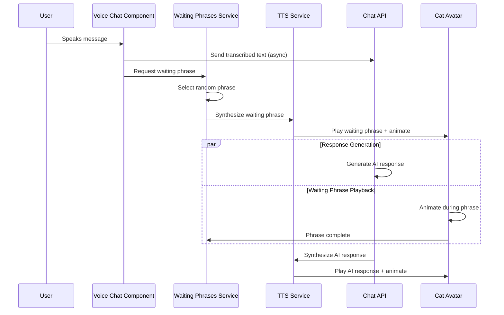

# Design Document

## Overview

The Voice Waiting Phrases feature enhances the user experience during voice chat by introducing engaging phrases that the bot speaks while generating AI responses. This eliminates the awkward 10-15 second silence that currently occurs during response generation, making conversations feel more natural and human-like.

The system integrates seamlessly with the existing voice chat infrastructure, utilizing the current TTS pipeline, cat avatar animation system, and multilingual support. The feature is designed to be configurable, maintainable, and extensible while maintaining backward compatibility.

## Architecture

### High-Level Flow



### System Integration Points

1. **Voice Services Integration**: Extends `voiceServices.js` with waiting phrase functionality
2. **TTS Pipeline**: Utilizes existing `/api/synthesize` endpoint for phrase synthesis
3. **I18n System**: Integrates with existing translation system for multilingual support
4. **Cat Avatar**: Works with existing animation and lip-sync systems
5. **Configuration**: Uses JSON-based configuration for phrase management

## Components and Interfaces

### 1. Waiting Phrases Service (`waitingPhrasesService.js`)

**Purpose**: Core service managing phrase selection, caching, and playback coordination.

**Key Functions**:
- `initializeWaitingPhrases()`: Load and cache phrases from configuration
- `selectWaitingPhrase(language)`: Select appropriate phrase for user's language
- `playWaitingPhrase(phrase, language)`: Synthesize and queue phrase for playback
- `getTranslatedPhrase(phrase, targetLanguage)`: Handle translation fallback

**Interface**:
```javascript
export interface WaitingPhrasesService {
  initializeWaitingPhrases(): Promise<void>;
  selectWaitingPhrase(language: string): Promise<string>;
  playWaitingPhrase(phrase: string, language: string): Promise<void>;
  isWaitingPhraseActive(): boolean;
}
```

### 2. Phrase Configuration (`waitingPhrases.json`)

**Purpose**: Centralized configuration file containing all waiting phrases in multiple languages.

**Structure**:
```json
{
  "phrases": {
    "general": {
      "en": [
        "Well, well, well. I need to think it over. Your question is very interesting.",
        "Let me ponder this for a moment...",
        "Hmm, that's a great question. Give me a second to think.",
        "Interesting! Let me process this carefully.",
        "Oh, I see what you're asking. Let me think about this."
      ],
      "ru": [
        "Хм, хм, хм. Мне нужно это обдумать. Ваш вопрос очень интересный.",
        "Позвольте мне подумать об этом минутку...",
        "Хм, это отличный вопрос. Дайте мне секунду подумать."
      ],
      "es": [
        "Bueno, bueno, bueno. Necesito pensarlo. Tu pregunta es muy interesante.",
        "Déjame reflexionar sobre esto por un momento...",
        "Hmm, esa es una gran pregunta. Dame un segundo para pensar."
      ]
    },
    "contextual": {
      "math": {
        "en": ["Let me work through this calculation...", "Mathematical problems require careful thought..."],
        "ru": ["Позвольте мне проработать этот расчет...", "Математические задачи требуют внимательного размышления..."],
        "es": ["Déjame resolver este cálculo...", "Los problemas matemáticos requieren un pensamiento cuidadoso..."]
      }
    }
  },
  "settings": {
    "avoidConsecutiveRepeats": true,
    "maxPhraseLength": 8,
    "fallbackToTranslation": true
  }
}
```

### 3. Enhanced Voice Services Integration

**Purpose**: Modify existing `voiceServices.js` to integrate waiting phrases into the voice chat flow.

**Key Modifications**:
- Add waiting phrase playback before AI response generation
- Implement phrase queue management alongside existing audio queue
- Ensure smooth transitions between waiting phrases and AI responses
- Maintain existing cat avatar animation compatibility

### 4. Translation Integration Service

**Purpose**: Bridge between waiting phrases and existing i18n system for translation fallback.

**Key Functions**:
- `translatePhrase(phrase, targetLanguage)`: Use existing translation mechanism
- `detectPhraseLanguage(phrase)`: Determine source language of phrase
- `getCachedTranslation(phrase, language)`: Manage translation cache

## Data Models

### Phrase Configuration Model
```javascript
{
  phrases: {
    [category]: {
      [languageCode]: string[]
    }
  },
  settings: {
    avoidConsecutiveRepeats: boolean,
    maxPhraseLength: number,
    fallbackToTranslation: boolean
  }
}
```

### Phrase Selection State
```javascript
{
  lastSelectedPhrase: string,
  lastSelectedCategory: string,
  phraseHistory: string[],
  currentLanguage: string
}
```

### Audio Queue Enhancement
```javascript
{
  type: 'waiting' | 'response',
  audioBlob: Blob,
  metadata: {
    isWaitingPhrase: boolean,
    originalText: string,
    language: string
  }
}
```

## Error Handling

### Graceful Degradation Strategy

1. **Configuration Loading Failure**:
   - Fall back to hardcoded default phrases in English
   - Log error for debugging but continue operation
   - Notify developers through console warnings

2. **Translation Service Failure**:
   - Use English phrases as fallback
   - Cache failed translation attempts to avoid repeated failures
   - Continue with voice chat functionality

3. **TTS Synthesis Failure for Waiting Phrases**:
   - Skip waiting phrase and proceed directly to AI response
   - Log error but don't interrupt user experience
   - Maintain existing voice chat behavior

4. **Phrase Selection Errors**:
   - Use default phrase from available set
   - Reset phrase history if corruption detected
   - Ensure system continues functioning

### Error Recovery Mechanisms

- **Retry Logic**: Implement exponential backoff for temporary failures
- **Circuit Breaker**: Disable waiting phrases temporarily if multiple consecutive failures
- **Fallback Chains**: English → Default phrases → Skip waiting phrase
- **State Recovery**: Reset phrase selection state if inconsistencies detected

## Testing Strategy

### Unit Testing

1. **Phrase Selection Logic**:
   - Test random selection without consecutive repeats
   - Verify language preference handling
   - Test fallback to translation mechanism

2. **Configuration Loading**:
   - Test valid configuration parsing
   - Test malformed configuration handling
   - Test missing language fallback

3. **Translation Integration**:
   - Test translation service integration
   - Test caching mechanism
   - Test error handling for translation failures

### Integration Testing

1. **Voice Chat Flow**:
   - Test complete voice interaction with waiting phrases
   - Verify smooth transition from waiting phrase to AI response
   - Test interruption handling during waiting phrases

2. **TTS Pipeline Integration**:
   - Test waiting phrase synthesis
   - Verify audio queue management
   - Test concurrent synthesis requests

3. **Cat Avatar Integration**:
   - Test animation continuity during phrase transitions
   - Verify lip-sync functionality with waiting phrases
   - Test emotion detection integration

### End-to-End Testing

1. **Multilingual Scenarios**:
   - Test phrase selection in different languages
   - Test translation fallback mechanism
   - Verify language consistency throughout conversation

2. **Error Scenarios**:
   - Test behavior with missing configuration
   - Test network failures during phrase synthesis
   - Test recovery from various error conditions

3. **Performance Testing**:
   - Measure impact on response time
   - Test memory usage with phrase caching
   - Verify no audio playback delays

## Performance Considerations

### Optimization Strategies

1. **Phrase Caching**:
   - Pre-load and cache frequently used phrases
   - Implement LRU cache for translated phrases
   - Cache synthesized audio for common phrases

2. **Lazy Loading**:
   - Load phrase configuration on first use
   - Initialize translation cache incrementally
   - Defer non-critical phrase categories

3. **Audio Optimization**:
   - Pre-synthesize common phrases during idle time
   - Implement audio compression for cached phrases
   - Use efficient audio queue management

### Memory Management

- Limit phrase history size to prevent memory leaks
- Implement cache size limits for translations
- Clean up audio blobs after playback completion
- Monitor and log memory usage patterns

## Security Considerations

### Input Validation

- Validate phrase configuration structure on load
- Sanitize user-provided language codes
- Prevent injection attacks through configuration files

### Content Security

- Ensure phrase content is appropriate and safe
- Implement content filtering for user-provided phrases
- Validate translation results for appropriateness

### Privacy Protection

- Don't log sensitive phrase content
- Ensure translation requests don't leak user data
- Implement secure caching mechanisms