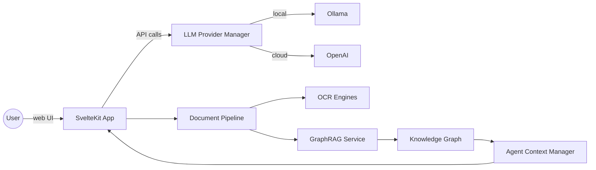
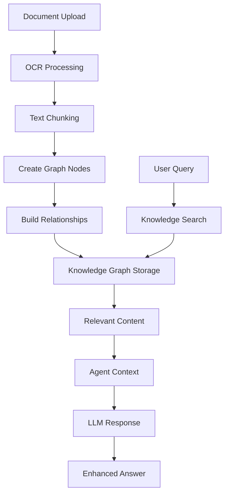

# AI Tutor Platform

[](https://opensource.org/licenses/MIT)
[](https://nodejs.org/)
[](https://kit.svelte.dev/)

## Overview

AI Tutor Platform is a modern, full-stack educational application built with SvelteKit that demonstrates how AI language models, speech processing, and computer vision can create engaging learning experiences. The platform features intelligent tutoring sessions with voice interaction, document understanding, mathematical formula rendering, and a sophisticated GraphRAG (Graph Retrieval-Augmented Generation) system for knowledge management.

**Key Capabilities:**
- 🤖 **Intelligent Tutoring**: Context-aware AI conversations with session management
- 🎙️ **Voice Interaction**: Speech-to-text and text-to-speech with animated avatar
- 📄 **Document Processing**: OCR for images/PDFs with GraphRAG knowledge integration
- 🧮 **Math Support**: Automatic LaTeX/KaTeX rendering for mathematical expressions
- 🌍 **Multi-language**: Interface available in English, Russian, and Spanish
- 🔧 **Flexible AI**: Supports both cloud (OpenAI) and local (Ollama) language models
- 👥 **Admin Dashboard**: User management, usage analytics, and moderation tools

This README is split into two parts:

1. **Product summary** – high level description aimed at product owners.
2. **Developer guide** – technical information for engineers who want to explore or extend the codebase.

---

## 1. Product Summary

- **Conversational tutoring** – learners interact with an AI tutor that keeps track of the conversation and previously uploaded materials to provide contextual answers.
- **Voice experience** – the app converts speech to text, speaks the response back, and shows an animated cat avatar that lip-syncs and displays emotions. While the tutor thinks, it plays a friendly “waiting phrase” so the student knows something is happening.
- **Document understanding** – students can attach pictures or PDFs of their assignments. Optical Character Recognition (OCR) extracts the text so the AI can refer to it in explanations.
- **Mathematical formula rendering** – the system automatically detects and renders mathematical expressions using KaTeX, converting plain text like `c^2 = a^2 + b^2` into properly formatted mathematical notation.
- **Multi-language interface** – user interface strings are available in English, Russian and Spanish, making the tutor approachable to a wider audience.
- **Flexible AI providers** – the tutor can run completely locally for privacy and cost savings or fall back to OpenAI’s API when more capability is required.

These features make the project a strong starting point for experimenting with AI-enhanced education tools, proof-of-concepts or bespoke tutoring products.

---

## 2. Developer Guide

### Technology Stack

**Frontend:**
- [SvelteKit](https://kit.svelte.dev/) - Full-stack web framework
- [Vite](https://vitejs.dev/) - Build tool and development server
- [Tailwind CSS](https://tailwindcss.com/) - Utility-first CSS framework
- [Lucide Svelte](https://lucide.dev/) - Icon library

**Backend & Database:**
- [Prisma](https://prisma.io/) - Database ORM and migrations
- [PostgreSQL](https://postgresql.org/) - Primary database
- Node.js - Server runtime

**AI & ML:**
- [OpenAI API](https://openai.com/api/) - GPT models, Whisper (STT), TTS
- [Ollama](https://ollama.ai) - Local LLM support
- [TensorFlow.js](https://tensorflow.org/js) - Face detection for avatar
- [Tesseract.js](https://tesseract.projectnaptha.com/) - OCR processing

**Testing & Quality:**
- [Vitest](https://vitest.dev/) - Unit and integration testing
- [Testing Library](https://testing-library.com/docs/svelte-testing-library/intro) - Component testing
- [ESLint](https://eslint.org/) + [Prettier](https://prettier.io/) - Code quality
- [Husky](https://typicode.github.io/husky/) - Git hooks

**Math & Documents:**
- [KaTeX](https://katex.org/) - Mathematical formula rendering
- [PDF.js](https://mozilla.github.io/pdf.js/) - PDF processing

### Key Features and Architecture

#### Modular LLM Provider System

A provider manager selects between OpenAI and local Ollama models, enabling fallback and provider switching in development.

#### GraphRAG Architecture

The platform implements a foundational GraphRAG (Graph Retrieval-Augmented Generation) system with the following components:

**Core Services:**

- `GraphRAGService`: Main service for creating and querying knowledge graphs from documents
- `DocumentGraphRAGProcessor`: Extends document processing to integrate GraphRAG capabilities
- `AgentContextManager`: Manages agent-specific context and material access with GraphRAG integration

**Knowledge Graph Structure:**

- **Nodes**: Represent chunks of processed document content with metadata
- **Relationships**: Connect related content both within and across documents
- **Embeddings**: Placeholder for vector representations (ready for integration with embedding models)
- **Material Assignments**: Control which agents can access which materials

**Processing Flow:**

1. Documents uploaded → OCR/text extraction
2. Content chunked → Knowledge graph nodes created
3. Relationships established → Cross-material connections identified
4. User queries → Relevant content retrieved → Agent responses augmented

**Extensibility:**
The current implementation provides a solid foundation that can be extended with:

- Real vector embedding models (currently uses placeholder embeddings)
- Advanced entity extraction and relationship detection
- Integration with vector databases for production-scale deployment
- Semantic similarity search instead of keyword-based matching

#### Admin Finance Dashboard

Administrators can review per-model usage counts and estimated OpenAI spend on the Finance page. Usage metrics are stored in-memory inside the application server; restart events clear the history. For production deployments consider persisting these aggregates to a database or analytics warehouse to avoid data loss.

OpenAI costs are calculated using the official [per-million token pricing](https://openai.com/api/pricing/) (e.g. \$0.50 per 1M prompt tokens and \$1.50 per 1M completion tokens for `gpt-3.5-turbo-0125`). Totals are tracked and displayed to eight decimal places so even micro-dollar spending is visible to administrators.

#### Voice Mode & Waiting Phrases

The platform provides a sophisticated voice interaction system with several key components:

**Speech Processing:**
- Speech-to-text uses the OpenAI Whisper API for accurate transcription
- Text-to-speech uses the OpenAI TTS API (or simulated responses in development)
- Audio buffer management for smooth playback and interruption handling

**Animated Cat Avatar:**
- Real-time lip-sync synchronized with audio amplitude
- Emotion detection and expression changes during conversations
- Smooth animation transitions between waiting phrases and AI responses
- Documented in `docs/cat-avatar-implementation.md`

**Waiting Phrases System:**
- Eliminates awkward silence during AI processing with friendly phrases
- Multilingual support with automatic language detection
- Configurable phrase variety to maintain natural conversation flow
- Sentence-by-sentence synthesis for smooth user experience
- Performance monitoring and graceful fallback handling

**Voice UX Enhancements:**
- Interruption detection and response generation
- Conversation flow management with natural rhythm
- Voice interaction logging and diagnostics
- Performance metrics tracking and optimization
- User preference panels for voice settings

**Key Components:**
- `WaitingPhrasesService`: Core phrase selection and playback logic
- `VoiceServices`: Speech processing and audio management
- `AvatarStateManager`: Avatar animation and emotion control
- `ConversationFlowManager`: Natural conversation pacing
- `VoiceErrorHandler`: Graceful error recovery and user feedback

#### Document Processing & RAG (Retrieval-Augmented Generation)

The platform implements a sophisticated GraphRAG system for intelligent document processing and knowledge retrieval:

**Document Processing Pipeline:**

- Uploaded images or PDFs are classified, preprocessed and sent through configurable OCR engines
- Recognized text is processed through the GraphRAG system to create knowledge graphs
- Documents are chunked into smaller pieces for better retrieval and processing
- Each chunk is converted into nodes in a knowledge graph with relationships

**GraphRAG Knowledge System:**

- **Knowledge Graph Creation**: Documents are processed to extract entities and create interconnected knowledge graphs per subject/course
- **Intelligent Chunking**: Content is split into manageable chunks (500 characters) with semantic boundaries
- **Relationship Mapping**: The system creates relationships between document chunks, both within documents and across different materials
- **Vector Embeddings**: Each chunk gets embedded for semantic similarity search (placeholder implementation ready for real embedding models)
- **Cross-Material Relationships**: The system identifies and creates relationships between similar content across different uploaded materials

**Agent Context Integration:**

- Each AI agent has access to relevant materials based on assignments and permissions
- When users ask questions, the system queries the knowledge graph to find relevant information
- Agent responses are augmented with contextual information from the knowledge base
- Conversation history is maintained per agent for better context understanding

**Query and Retrieval:**

- Simple keyword-based search with scoring and ranking (extensible to vector similarity)
- Results are limited and ranked by relevance to prevent information overload
- Supports real-time updates when materials are modified or deleted
- Fallback mechanisms ensure the system works even without GraphRAG processing

#### Internationalisation

All interface strings live in `src/lib/modules/i18n/translations.js` with helpers to fetch the correct language.

#### Waiting Phrases

While the AI prepares a response, short phrases are displayed and synthesized sentence by sentence for a smooth user experience.

### Project Structure

```
├── .kiro/                     # Kiro AI assistant configuration and specs
│   └── specs/                 # Feature specifications and requirements
├── docs/                      # Additional documentation and guides
├── prisma/                    # Database schema and migrations
├── scripts/                   # Utility scripts for maintenance
├── src/
│   ├── generated/             # Generated Prisma client files
│   ├── lib/
│   │   ├── components/        # Shared UI components (MathRenderer, etc.)
│   │   ├── config/            # Configuration files and schemas
│   │   ├── database/          # Database utilities and connection
│   │   │   └── repositories/  # Data access layer
│   │   ├── modules/           # Feature modules
│   │   │   ├── admin/         # Admin dashboard functionality
│   │   │   ├── analytics/     # Usage analytics and metrics
│   │   │   ├── auth/          # Authentication system
│   │   │   ├── chat/          # Chat interface and voice processing
│   │   │   │   ├── components/    # Chat UI components
│   │   │   │   └── examples/      # Usage examples
│   │   │   ├── courses/       # Course management system
│   │   │   │   ├── services/      # Course services with GraphRAG
│   │   │   │   └── stores/        # Course state management
│   │   │   ├── document/      # Document processing and OCR
│   │   │   ├── i18n/          # Internationalization
│   │   │   ├── learn/         # Learning interface components
│   │   │   │   └── components/    # Learning UI components
│   │   │   ├── llm/           # Language model providers
│   │   │   ├── navigation/    # Navigation components
│   │   │   ├── secure-course-bot/ # Security testing module
│   │   │   ├── session/       # Session management and messaging
│   │   │   │   ├── components/    # Session UI components
│   │   │   │   ├── services/      # Session and message services
│   │   │   │   └── stores/        # Session state management
│   │   │   ├── subjects/      # Subject management with GraphRAG
│   │   │   │   ├── components/    # Subject UI components
│   │   │   │   ├── services/      # GraphRAG, moderation, agents
│   │   │   │   ├── stores/        # Subject state management
│   │   │   │   └── utils/         # Subject utilities
│   │   │   └── theme/         # Theme and styling
│   │   ├── shared/            # Shared utilities and components
│   │   │   ├── components/    # Reusable UI components
│   │   │   ├── di/            # Dependency injection
│   │   │   └── utils/         # Utility functions
│   │   ├── stores/            # Global Svelte stores
│   │   └── utils/             # General utility functions
│   ├── routes/                # SvelteKit routes and API endpoints
│   │   ├── api/               # REST API endpoints
│   │   │   ├── admin/         # Admin API endpoints
│   │   │   ├── chat/          # Chat API endpoints
│   │   │   ├── courses/       # Course API endpoints
│   │   │   ├── messages/      # Message API endpoints
│   │   │   ├── sessions/      # Session API endpoints
│   │   │   └── [other APIs]   # Various API endpoints
│   │   ├── admin/             # Admin dashboard pages
│   │   ├── catalogue/         # Course catalogue pages
│   │   ├── learn/             # Learning interface pages
│   │   ├── my-courses/        # User course management
│   │   ├── my-subjects/       # User subject management
│   │   ├── sessions/          # Session management UI
│   │   └── [test pages]/      # Various test and debug pages
│   ├── app.css                # Global styles
│   ├── app.html               # Application entry point
│   └── hooks.server.js        # Server-side hooks
├── static/                    # Static assets (images, models, icons)
├── tests/                     # Comprehensive test suites
│   ├── auth/                  # Authentication tests
│   ├── diagnostics/           # Diagnostic and debugging tests
│   ├── e2e/                   # End-to-end tests
│   │   ├── admin/             # Admin functionality tests
│   │   └── catalogue/         # Catalogue functionality tests
│   ├── integration/           # Integration tests
│   │   ├── admin/             # Admin integration tests
│   │   ├── api/               # API integration tests
│   │   ├── catalogue/         # Catalogue integration tests
│   │   ├── chat/              # Chat and voice integration tests
│   │   ├── document/          # Document processing tests
│   │   ├── navigation/        # Navigation tests
│   │   ├── routes/            # Route integration tests
│   │   ├── secure-course-bot/ # Security validation tests
│   │   └── session/           # Session integration tests
│   ├── manual/                # Manual testing procedures
│   ├── session/               # Session-specific tests
│   ├── unit/                  # Unit tests
│   │   ├── admin/             # Admin unit tests
│   │   ├── api/               # API unit tests
│   │   ├── auth/              # Authentication unit tests
│   │   ├── chat/              # Chat and voice unit tests
│   │   ├── courses/           # Course unit tests
│   │   ├── document/          # Document processing unit tests
│   │   ├── llm/               # LLM provider unit tests
│   │   ├── navigation/        # Navigation unit tests
│   │   ├── session/           # Session unit tests
│   │   ├── subjects/          # Subject unit tests
│   │   └── utils/             # Utility unit tests
│   ├── OldREADME.md          # Legacy test documentation
│   └── setup.js              # Test setup and configuration
└── venv/                      # Python virtual environment (for scripts)
```

### Prerequisites / System Requirements

- **Node.js**: version 18 or later
- **npm**: version 9 or later
- **Optional local models**: [Ollama](https://ollama.ai) running locally (8 GB RAM recommended)
- **Browsers**: recent Chrome, Firefox, Safari or Edge
- **Audio hardware**: microphone and speakers for voice mode

### Quick Start

1. **Clone and install dependencies**
   ```bash
   git clone <repository-url>
   cd ai-tutor-platform
   npm install
   ```

2. **Set up environment**
   ```bash
   cp .env.example .env
   # Edit .env with your OpenAI API key and other settings
   ```

3. **Set up database** (if using PostgreSQL)
   ```bash
   npm run db:generate
   npm run db:migrate
   ```

4. **Start development server**
   ```bash
   npm run dev
   ```
   Open [http://localhost:5173](http://localhost:5173) in your browser.

5. **Optional: Set up local LLM**
   ```bash
   # Install Ollama (macOS)
   brew install ollama
   
   # Start Ollama service
   ollama serve
   
   # Pull a model (in another terminal)
   ollama pull qwen2.5:1.5b
   ```

### Available Scripts

| Command | Description |
|---------|-------------|
| `npm run dev` | Start development server |
| `npm run build` | Build for production |
| `npm run preview` | Preview production build |
| `npm run test` | Run auth tests |
| `npm run test:run` | Run all tests |
| `npm run test:coverage` | Run tests with coverage |
| `npm run test:e2e` | Run end-to-end tests |
| `npm run lint` | Lint selected files |
| `npm run format` | Format code with Prettier |
| `npm run db:migrate` | Run database migrations |
| `npm run db:studio` | Open Prisma Studio |
| `npm run db:reset` | Reset database |

### Installation Troubleshooting

- Use the required Node version (`node -v`) if `npm install` fails
- Run `npm cache clean --force` and reinstall if dependency resolution errors appear
- Ensure `VITE_OPENAI_API_KEY` is set to avoid 401 errors from OpenAI
- If Ollama is unreachable, verify it is running and matches `VITE_OLLAMA_API_URL`

### Configuration

| Variable                           | Description                         | Default                   | Required |
| ---------------------------------- | ----------------------------------- | ------------------------- | -------- |
| `VITE_OPENAI_API_KEY`              | OpenAI key for LLM, Whisper and TTS | –                         | **Yes**  |
| `VITE_DEFAULT_LLM_PROVIDER`        | `openai` or `ollama`                | `ollama`                  | No       |
| `VITE_ENABLE_LOCAL_LLM`            | Enable local model usage            | `true`                    | No       |
| `VITE_ENABLE_LLM_FALLBACK`         | Fall back to OpenAI if local fails  | `true`                    | No       |
| `VITE_ENABLE_PROVIDER_SWITCHING`   | Allow switching in UI               | `false` (true in dev)     | No       |
| `VITE_LLM_FALLBACK_TIMEOUT`        | ms before provider fallback         | `10000`                   | No       |
| `VITE_OLLAMA_API_URL`              | Ollama endpoint                     | `http://127.0.0.1:11434`  | No       |
| `VITE_OLLAMA_MODELS`               | Comma list of Ollama models         | `qwen2.5:1.5b,qwen2.5:7b` | No       |
| `VITE_OLLAMA_MODEL`                | Single model (legacy)               | first of MODELS           | No       |
| `VITE_OLLAMA_MAX_TOKENS`           | Max tokens from Ollama              | `256`                     | No       |
| `VITE_OLLAMA_TEMPERATURE`          | Sampling temperature                | `0.7`                     | No       |
| `VITE_OLLAMA_NUM_CTX`              | Context window tokens               | `2048`                    | No       |
| `VITE_OLLAMA_STRICT`               | Restrict to MODELS list             | `true`                    | No       |
| `VITE_OLLAMA_REPEAT_PENALTY`       | Repetition penalty                  | `1.1`                     | No       |
| `VITE_OLLAMA_TOP_P`                | Nucleus sampling parameter          | `0.9`                     | No       |
| `VITE_OLLAMA_TOP_K`                | Top-k sampling size                 | `40`                      | No       |
| `VITE_LLM_MEMORY_THRESHOLD`        | MB before switching to cloud        | `2048`                    | No       |
| `VITE_LLM_CPU_THRESHOLD`           | CPU load threshold                  | `0.95`                    | No       |
| `VITE_LLM_RESOURCE_CHECK_INTERVAL` | Resource check ms                   | `5000`                    | No       |
| `VITE_OPENAI_MODEL`                | OpenAI model                        | `gpt-3.5-turbo`           | No       |
| `VITE_OPENAI_MAX_TOKENS`           | Tokens for OpenAI replies           | `500`                     | No       |
| `VITE_OPENAI_DETAILED_MAX_TOKENS`  | Tokens for detailed replies         | `4000`                    | No       |
| `VITE_OPENAI_TEMPERATURE`          | OpenAI sampling temperature         | `0.7`                     | No       |
| `VITE_OPENAI_MAX_RETRIES`          | API retry attempts                  | `3`                       | No       |
| `VITE_OPENAI_RETRY_DELAY`          | Delay between retries (ms)          | `1000`                    | No       |
| `VITE_OPENAI_TIMEOUT`              | Request timeout ms                  | `30000`                   | No       |
| `VITE_WAITING_PHRASES_DEFAULT`     | ID of default waiting phrase        | `DefaultWaitingAnswer`    | No       |
| `VITE_WAITING_PHRASES_DETAILED`    | ID for detailed waiting phrase      | `DetailedWaitingAnswer`   | No       |
| `VITE_VOICE_INTERRUPTION_ENABLED`  | Enable voice interruption detection | `true`                    | No       |
| `VITE_AVATAR_EMOTIONS_ENABLED`     | Enable avatar emotion detection     | `true`                    | No       |
| `VITE_VOICE_DIAGNOSTICS_ENABLED`   | Enable voice performance monitoring | `false` (true in dev)     | No       |

Example `.env`:

```bash
VITE_OPENAI_API_KEY=your-api-key
VITE_DEFAULT_LLM_PROVIDER=ollama
VITE_ENABLE_LOCAL_LLM=true
VITE_ENABLE_LLM_FALLBACK=true
VITE_ENABLE_PROVIDER_SWITCHING=false
VITE_LLM_FALLBACK_TIMEOUT=10000

VITE_OLLAMA_API_URL=http://127.0.0.1:11434
VITE_OLLAMA_MODELS=qwen2.5:1.5b,qwen2.5:7b
VITE_OLLAMA_MAX_TOKENS=256
VITE_OLLAMA_TEMPERATURE=0.7
VITE_OLLAMA_NUM_CTX=2048
VITE_OLLAMA_STRICT=true
VITE_OLLAMA_REPEAT_PENALTY=1.1
VITE_OLLAMA_TOP_P=0.9
VITE_OLLAMA_TOP_K=40

VITE_LLM_MEMORY_THRESHOLD=2048
VITE_LLM_CPU_THRESHOLD=0.95
VITE_LLM_RESOURCE_CHECK_INTERVAL=5000

VITE_OPENAI_MODEL=gpt-3.5-turbo
VITE_OPENAI_MAX_TOKENS=500
VITE_OPENAI_DETAILED_MAX_TOKENS=4000
VITE_OPENAI_TEMPERATURE=0.7
VITE_OPENAI_MAX_RETRIES=3
VITE_OPENAI_RETRY_DELAY=1000
VITE_OPENAI_TIMEOUT=30000
VITE_WAITING_PHRASES_DEFAULT=DefaultWaitingAnswer
VITE_WAITING_PHRASES_DETAILED=DetailedWaitingAnswer
```

### Usage Examples

**Basic Tutoring:**
- Open the app and type a question to start a conversation
- Ask follow-up questions - the AI maintains context throughout the session
- Switch between different subjects/courses for specialized tutoring

**Voice Interaction:**
- Click the microphone button to enable voice mode
- Speak your question and listen to the tutor's spoken reply
- Watch the animated cat avatar provide visual feedback during conversations
- Experience natural conversation flow with waiting phrases during AI processing
- Enjoy multilingual voice support with automatic language detection
- Use voice preferences panel to customize speech settings and avatar behavior

**Document-Enhanced Learning:**
- Upload images or PDFs via the paperclip icon
- Ask questions about uploaded materials - the AI uses GraphRAG to provide contextual answers
- Upload multiple related documents for comprehensive cross-material analysis

**Mathematical Learning:**
- Type mathematical expressions using standard notation (e.g., `x^2 + 2x + 1`)
- Formulas are automatically rendered using KaTeX for proper mathematical display
- Ask for step-by-step solutions to mathematical problems

**Admin Features:**
- Access `/admin` for user management and system analytics
- Monitor API usage and costs in the finance dashboard
- Manage course content and user enrollments

### API Documentation

_To be documented in a future update._

### Deployment

**Production Build:**
```bash
# Install dependencies
npm ci --production

# Set up environment variables
cp .env.example .env.production
# Configure production values in .env.production

# Run database migrations
npm run db:migrate

# Build the application
npm run build

# Start production server
npm start
```

**Environment Setup:**
- Set `NODE_ENV=production`
- Configure `VITE_OPENAI_API_KEY` with your production API key
- Set up PostgreSQL database and update connection string
- Configure `VITE_DEFAULT_LLM_PROVIDER` based on your deployment needs

**Docker Deployment:**
```dockerfile
FROM node:18-alpine
WORKDIR /app
COPY package*.json ./
RUN npm ci --production
COPY . .
RUN npm run build
EXPOSE 3000
CMD ["npm", "start"]
```

**Recommended Production Settings:**
- Use PostgreSQL for persistent data storage
- Set up proper logging and monitoring
- Configure rate limiting for API endpoints
- Use HTTPS in production
- Set up backup strategies for user data and sessions

### Testing & Quality

The platform includes comprehensive testing across multiple layers with special focus on voice interaction features.

#### Test Structure

**Unit Tests** (`tests/unit/`)
- Core service logic and utilities
- Voice processing components
- Waiting phrases configuration and selection
- Translation bridge functionality
- Session and message services

**Integration Tests** (`tests/integration/`)
- Cat avatar animation synchronization
- Voice chat feature compatibility  
- Multilingual i18n system integration
- Error handling and graceful degradation
- Performance impact assessment

**End-to-End Tests** (`tests/e2e/`)
- Complete voice interaction flows
- User experience validation
- Error scenarios and recovery
- Accessibility compliance testing

#### Voice Feature Testing

**Integration Test Coverage:**
- **Cat Avatar Integration**: Animation sync, emotion handling, lip-sync during waiting phrases
- **Voice Chat Features**: Complete voice flow, audio queue management, interruption handling
- **Multilingual Integration**: UI translations, language consistency, translation fallback
- **System Integration**: Component interaction, performance monitoring, resource cleanup

**Key Test Scenarios:**

*Happy Path:*
1. User recording → transcription → waiting phrase → AI response → synthesis → playback
2. Multiple consecutive interactions with phrase variety
3. Multilingual conversations with proper language detection

*Error Handling:*
1. Transcription service failures with graceful fallback
2. Waiting phrase synthesis failures with continued AI response
3. Network connectivity issues with appropriate user feedback
4. AI response generation failures with proper error handling

*Edge Cases:*
1. Very fast AI responses (shorter than waiting phrase duration)
2. Very slow AI responses (multiple waiting phrases)
3. User interruptions during waiting phrase playback
4. Rapid consecutive interactions and language switching

#### Performance Benchmarks

**Response Time Targets:**
- Complete voice interaction: < 8 seconds
- Waiting phrase selection: < 100ms
- UI state transitions: < 200ms
- Avatar animation updates: 60fps target

**Memory Management:**
- Phrase history limited to 5 items
- Translation cache with reasonable limits
- Proper cleanup of audio resources
- No memory leaks during extended use

#### Accessibility Testing

**Keyboard Navigation:**
- All interactive elements focusable with proper tab order
- Keyboard shortcuts functional for voice controls
- Screen reader compatibility with ARIA labels

**Visual & Audio Indicators:**
- Clear visual feedback for all voice states
- High contrast status indicators
- Animation respects user motion preferences
- Status updates announced appropriately for screen readers

#### Running Tests

```bash
# Run all tests
npm test

# Run tests once (CI mode)
npm run test:run

# Run with coverage report
npm run test:coverage

# Run with UI interface
npm run test:ui

# Run specific test suites
npm run test:integration    # Integration tests
npm run test:e2e           # End-to-end tests

# Voice-specific test patterns
npm run test:run -- --grep "voice"
npm run test:run -- --grep "waiting.*phrase"
npm run test:run -- --grep "avatar"
```

#### Mock Strategy

**Browser APIs:**
- AudioContext and Web Audio API simulation
- MediaRecorder and getUserMedia mocking
- Audio playback and synthesis simulation
- Image loading and manipulation for avatar

**External Services:**
- Transcription API response mocking
- AI chat API response simulation
- Text-to-speech synthesis mocking
- Translation service fallbacks

#### Code Quality

```bash
npm run lint      # ESLint validation
npm run format    # Prettier formatting
```

### Performance & Limitations

- File uploads are limited to 10 MB and common image/PDF formats
- Local LLM models should be small enough for available RAM (8 GB machines are assumed)
- Throughput depends on external APIs; concurrent users are limited by server resources

### Security Considerations

_Security best practices and threat models will be documented later._

### Changelog / Version History

See [CHANGELOG.md](CHANGELOG.md) for full release notes.

### Troubleshooting

**Common Issues:**

| Problem | Solution |
|---------|----------|
| App fails to start | Verify Node.js ≥18, run `npm install`, check `.env` file |
| Database connection errors | Run `npm run db:migrate`, check PostgreSQL connection |
| OCR results are poor | Ensure images are clear, under 10MB, good contrast |
| No response from AI tutor | Check API keys, network connectivity, try switching providers |
| Voice mode not working | Check microphone permissions, ensure HTTPS in production |
| Waiting phrases not playing | Verify TTS service, check audio permissions, test phrase configuration |
| Avatar not lip-syncing | Check TensorFlow.js loading, verify camera permissions for face detection |
| Voice interruptions failing | Test audio buffer management, check interruption detection settings |
| Multilingual voice issues | Verify language detection, check translation service availability |
| Math formulas not rendering | Verify KaTeX is loaded, check console for JavaScript errors |
| Local LLM not responding | Ensure Ollama is running, model is pulled, check API URL |

**Debug Mode:**
```bash
# Enable detailed logging
npm run dev

# Check database connection
npm run db:test

# Run specific test suites
npm run test:integration
npm run test:e2e
```

**Performance Issues:**
- Monitor memory usage with local LLMs (8GB+ recommended)
- Check network latency for OpenAI API calls
- Optimize document upload sizes (< 10MB recommended)
- Clear browser cache if UI becomes unresponsive

**Voice Performance Debugging:**
```bash
# Test voice components individually
npm run test:run -- --grep "voice.*performance"

# Monitor audio buffer performance
npm run test:run -- --grep "audio.*buffer"

# Check avatar animation performance
npm run test:run -- --grep "avatar.*performance"

# Validate waiting phrases timing
npm run test:run -- --grep "waiting.*phrase.*timing"
```

**Voice-Specific Performance Targets:**
- Voice interaction latency: < 8 seconds end-to-end
- Waiting phrase selection: < 100ms
- Avatar animation: 60fps with smooth lip-sync
- Audio buffer management: No dropouts or glitches
- Memory usage: Proper cleanup after voice sessions

### Architecture Diagrams



**GraphRAG Data Flow:**



### Additional Documentation

Further design notes and troubleshooting guides live in the `docs/` folder:

- `cat-avatar-implementation.md` – animated avatar and lip-sync feature
- `waiting-phrases.md` and `waiting-phrases-troubleshooting.md` – configuration for the “waiting” messages

### Voice Testing & Quality Assurance

The platform includes comprehensive testing specifically designed for voice interaction features:

#### Voice Test Coverage Areas

**Integration Testing:**
- ✅ Cat avatar animation system integration
- ✅ Voice chat features compatibility
- ✅ Multilingual i18n system integration
- ✅ Error handling and graceful degradation
- ✅ Performance impact assessment

**End-to-End Testing:**
- ✅ Complete voice interaction flow validation
- ✅ Error scenarios and recovery mechanisms
- ✅ User experience improvements validation
- ✅ Timing and sequencing verification
- ✅ Accessibility compliance testing

**Key Test Files:**
- `tests/integration/chat/systemIntegration.test.js` - Core system integration
- `tests/integration/chat/catAvatarIntegration.test.js` - Avatar functionality
- `tests/integration/chat/multilingualIntegration.test.js` - Language support
- `tests/e2e/voiceChatFlow.test.js` - Complete voice workflows
- `tests/e2e/userExperienceValidation.test.js` - UX validation

#### Voice Performance Standards

**Response Time Requirements:**
- Complete voice interaction: < 8 seconds
- Waiting phrase selection: < 100ms
- UI state transitions: < 200ms
- Avatar animation: 60fps target

**Quality Metrics:**
- Phrase history management (5 item limit)
- Translation cache optimization
- Audio resource cleanup
- Memory leak prevention

#### Future Voice Testing Enhancements

**Planned Additions:**
- Visual regression testing for avatar animations
- Audio quality testing for synthesized phrases
- Load testing with multiple concurrent voice users
- Cross-browser voice compatibility testing
- Mobile device voice interaction testing

### GraphRAG Implementation Details

The platform's GraphRAG system is designed as a foundational implementation that can be extended with production-ready components:

**Current Implementation:**

- **Knowledge Graph Storage**: In-memory storage using Maps (suitable for development and small deployments)
- **Text Chunking**: Simple sentence-based chunking with configurable size limits (500 characters default)
- **Relationship Detection**: Basic sequential and keyword-based relationship creation
- **Query System**: Keyword matching with relevance scoring and ranking
- **Embeddings**: Placeholder random vectors (ready for real embedding model integration)

**Production Readiness Path:**

- Replace in-memory storage with persistent vector databases (Pinecone, Weaviate, etc.)
- Integrate real embedding models (OpenAI embeddings, sentence-transformers, etc.)
- Implement advanced entity extraction and relationship detection
- Add semantic similarity search using vector operations
- Scale to handle larger document collections and concurrent users

**Key Classes:**

- `GraphRAGService`: Core knowledge graph operations and querying
- `DocumentGraphRAGProcessor`: Document processing pipeline with GraphRAG integration
- `AgentContextManager`: Agent-specific context management with material access control

The modular design allows for incremental upgrades from the current foundational implementation to a production-scale GraphRAG system.

## Contributing

We welcome contributions! Please see [CONTRIBUTING.md](CONTRIBUTING.md) for detailed guidelines.

**Development Workflow:**
1. Fork the repository
2. Create a feature branch: `git checkout -b feature/amazing-feature`
3. Make your changes and add tests
4. Run the test suite: `npm run test:run`
5. Commit with conventional commits: `git commit -m "feat: add amazing feature"`
6. Push to your branch: `git push origin feature/amazing-feature`
7. Open a Pull Request

**Code Quality:**
- Follow ESLint and Prettier configurations
- Write tests for new features
- Update documentation as needed
- Use conventional commit messages

## Roadmap

- [ ] **Enhanced GraphRAG**: Vector embeddings and semantic search
- [ ] **Real-time Collaboration**: Multi-user sessions and shared workspaces
- [ ] **Advanced Analytics**: Learning progress tracking and insights
- [ ] **Mobile App**: React Native or Flutter companion app
- [ ] **Plugin System**: Extensible architecture for custom integrations
- [ ] **Offline Mode**: Local-first capabilities with sync

## Community & Support

- **Issues**: [GitHub Issues](https://github.com/your-repo/issues)
- **Discussions**: [GitHub Discussions](https://github.com/your-repo/discussions)
- **Documentation**: See `docs/` folder for detailed guides
- **Examples**: Check `src/lib/modules/*/examples/` for usage examples

## License

This project is licensed under the [MIT License](LICENSE) - see the LICENSE file for details.

## Acknowledgments

- [SvelteKit](https://kit.svelte.dev/) team for the excellent framework
- [OpenAI](https://openai.com/) for powerful AI APIs
- [Ollama](https://ollama.ai/) for local LLM capabilities
- All contributors who help improve this project

---

**Happy Teaching! 🎓✨**

*Built with ❤️ using SvelteKit and modern AI technologies*
