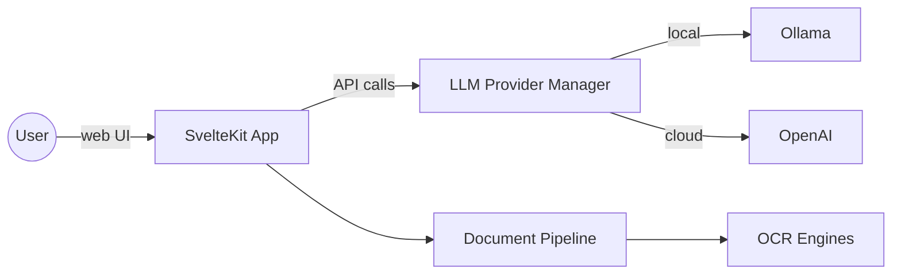

# AI Tutor Platform

## Overview

AI Tutor Platform is a SvelteKit-based web application that demonstrates how modern language models, speech tools and computer vision can come together to build an engaging learning assistant. The project offers both text and voice chat modes, understands documents and images, and can run on either cloud models such as OpenAI or locally hosted models via [Ollama](https://github.com/ollama/ollama).

This README is split into two parts:

1. **Product summary** – high level description aimed at product owners.
2. **Developer guide** – technical information for engineers who want to explore or extend the codebase.

---

## 1. Product Summary

* **Conversational tutoring** – learners interact with an AI tutor that keeps track of the conversation and previously uploaded materials to provide contextual answers.
* **Voice experience** – the app converts speech to text, speaks the response back, and shows an animated cat avatar that lip-syncs and displays emotions. While the tutor thinks, it plays a friendly “waiting phrase” so the student knows something is happening.
* **Document understanding** – students can attach pictures or PDFs of their assignments. Optical Character Recognition (OCR) extracts the text so the AI can refer to it in explanations.
* **Multi-language interface** – user interface strings are available in English, Russian and Spanish, making the tutor approachable to a wider audience.
* **Flexible AI providers** – the tutor can run completely locally for privacy and cost savings or fall back to OpenAI’s API when more capability is required.

These features make the project a strong starting point for experimenting with AI-enhanced education tools, proof-of-concepts or bespoke tutoring products.

---

## 2. Developer Guide

### Technology Stack

* [SvelteKit](https://kit.svelte.dev/) for the web application framework
* [Vite](https://vitejs.dev/) for development and building
* [Tailwind CSS](https://tailwindcss.com/) for styling
* [Vitest](https://vitest.dev/) and [Testing Library](https://testing-library.com/docs/svelte-testing-library/intro) for unit, integration and e2e tests
* Optional local LLM support through [Ollama](https://ollama.ai)

### Key Features and Architecture

#### Modular LLM Provider System

A provider manager selects between OpenAI and local Ollama models, enabling fallback and provider switching in development.

#### Admin Finance Dashboard

Administrators can review per-model usage counts and estimated OpenAI spend on the Finance page. Usage metrics are stored in-memory inside the application server; restart events clear the history. For production deployments consider persisting these aggregates to a database or analytics warehouse to avoid data loss.

OpenAI costs are calculated using the official [per-million token pricing](https://openai.com/api/pricing/) (e.g. \$0.50 per 1M prompt tokens and \$1.50 per 1M completion tokens for `gpt-3.5-turbo-0125`). Totals are tracked and displayed to eight decimal places so even micro-dollar spending is visible to administrators.

#### Voice Mode

Speech-to-text uses the OpenAI Whisper API, while text-to-speech uses the OpenAI TTS API (or a simulated response in development). The animated cat avatar with lip-syncing and emotion detection is documented in `docs/cat-avatar-implementation.md`.

#### Document Processing

Uploaded images or PDFs are classified, preprocessed and sent through configurable OCR engines. Recognized text is stored in session context so the tutor can reference it in later messages.

#### Internationalisation

All interface strings live in `src/lib/modules/i18n/translations.js` with helpers to fetch the correct language.

#### Waiting Phrases

While the AI prepares a response, short phrases are displayed and synthesized sentence by sentence for a smooth user experience.

### Project Structure

```
├── docs/                  Additional documentation (cat avatar, waiting phrases…)
├── src/
│   ├── lib/
│   │   ├── config/        API and LLM configuration
│   │   ├── modules/       Feature modules (auth, chat, document, llm, session…)
│   │   ├── shared/        DI container, utilities and UI components
│   │   └── stores/        Global Svelte stores
│   ├── routes/            SvelteKit routes and API endpoints
│   └── app.html/css       Application entry points
└── tests/                 Unit, integration and e2e tests
```

### Prerequisites / System Requirements

* **Node.js**: version 18 or later
* **npm**: version 9 or later
* **Optional local models**: [Ollama](https://ollama.ai) running locally (8 GB RAM recommended)
* **Browsers**: recent Chrome, Firefox, Safari or Edge
* **Audio hardware**: microphone and speakers for voice mode

### Getting Started

1. **Install dependencies**

   ```bash
   npm install
   ```
2. **Copy environment template**

   ```bash
   cp .env.example .env
   ```
3. **Start development server**

   ```bash
   npm run dev
   ```
4. **Build for production preview**

   ```bash
   npm run build
   npm run preview
   ```

### Installation Troubleshooting

* Use the required Node version (`node -v`) if `npm install` fails
* Run `npm cache clean --force` and reinstall if dependency resolution errors appear
* Ensure `VITE_OPENAI_API_KEY` is set to avoid 401 errors from OpenAI
* If Ollama is unreachable, verify it is running and matches `VITE_OLLAMA_API_URL`

### Configuration

| Variable                           | Description                         | Default                   | Required |
| ---------------------------------- | ----------------------------------- | ------------------------- | -------- |
| `VITE_OPENAI_API_KEY`              | OpenAI key for LLM, Whisper and TTS | –                         | **Yes**  |
| `VITE_DEFAULT_LLM_PROVIDER`        | `openai` or `ollama`                | `ollama`                  | No       |
| `VITE_ENABLE_LOCAL_LLM`            | Enable local model usage            | `true`                    | No       |
| `VITE_ENABLE_LLM_FALLBACK`         | Fall back to OpenAI if local fails  | `true`                    | No       |
| `VITE_ENABLE_PROVIDER_SWITCHING`   | Allow switching in UI               | `false` (true in dev)     | No       |
| `VITE_LLM_FALLBACK_TIMEOUT`        | ms before provider fallback         | `10000`                   | No       |
| `VITE_OLLAMA_API_URL`              | Ollama endpoint                     | `http://127.0.0.1:11434`  | No       |
| `VITE_OLLAMA_MODELS`               | Comma list of Ollama models         | `qwen2.5:1.5b,qwen2.5:7b` | No       |
| `VITE_OLLAMA_MODEL`                | Single model (legacy)               | first of MODELS           | No       |
| `VITE_OLLAMA_MAX_TOKENS`           | Max tokens from Ollama              | `256`                     | No       |
| `VITE_OLLAMA_TEMPERATURE`          | Sampling temperature                | `0.7`                     | No       |
| `VITE_OLLAMA_NUM_CTX`              | Context window tokens               | `2048`                    | No       |
| `VITE_OLLAMA_STRICT`               | Restrict to MODELS list             | `true`                    | No       |
| `VITE_OLLAMA_REPEAT_PENALTY`       | Repetition penalty                  | `1.1`                     | No       |
| `VITE_OLLAMA_TOP_P`                | Nucleus sampling parameter          | `0.9`                     | No       |
| `VITE_OLLAMA_TOP_K`                | Top-k sampling size                 | `40`                      | No       |
| `VITE_LLM_MEMORY_THRESHOLD`        | MB before switching to cloud        | `2048`                    | No       |
| `VITE_LLM_CPU_THRESHOLD`           | CPU load threshold                  | `0.95`                    | No       |
| `VITE_LLM_RESOURCE_CHECK_INTERVAL` | Resource check ms                   | `5000`                    | No       |
| `VITE_OPENAI_MODEL`                | OpenAI model                        | `gpt-3.5-turbo`           | No       |
| `VITE_OPENAI_MAX_TOKENS`           | Tokens for OpenAI replies           | `500`                     | No       |
| `VITE_OPENAI_DETAILED_MAX_TOKENS`  | Tokens for detailed replies         | `4000`                    | No       |
| `VITE_OPENAI_TEMPERATURE`          | OpenAI sampling temperature         | `0.7`                     | No       |
| `VITE_OPENAI_MAX_RETRIES`          | API retry attempts                  | `3`                       | No       |
| `VITE_OPENAI_RETRY_DELAY`          | Delay between retries (ms)          | `1000`                    | No       |
| `VITE_OPENAI_TIMEOUT`              | Request timeout ms                  | `30000`                   | No       |
| `VITE_WAITING_PHRASES_DEFAULT`     | ID of default waiting phrase        | `DefaultWaitingAnswer`    | No       |
| `VITE_WAITING_PHRASES_DETAILED`    | ID for detailed waiting phrase      | `DetailedWaitingAnswer`   | No       |

Example `.env`:

```bash
VITE_OPENAI_API_KEY=your-api-key
VITE_DEFAULT_LLM_PROVIDER=ollama
VITE_ENABLE_LOCAL_LLM=true
VITE_ENABLE_LLM_FALLBACK=true
VITE_ENABLE_PROVIDER_SWITCHING=false
VITE_LLM_FALLBACK_TIMEOUT=10000

VITE_OLLAMA_API_URL=http://127.0.0.1:11434
VITE_OLLAMA_MODELS=qwen2.5:1.5b,qwen2.5:7b
VITE_OLLAMA_MAX_TOKENS=256
VITE_OLLAMA_TEMPERATURE=0.7
VITE_OLLAMA_NUM_CTX=2048
VITE_OLLAMA_STRICT=true
VITE_OLLAMA_REPEAT_PENALTY=1.1
VITE_OLLAMA_TOP_P=0.9
VITE_OLLAMA_TOP_K=40

VITE_LLM_MEMORY_THRESHOLD=2048
VITE_LLM_CPU_THRESHOLD=0.95
VITE_LLM_RESOURCE_CHECK_INTERVAL=5000

VITE_OPENAI_MODEL=gpt-3.5-turbo
VITE_OPENAI_MAX_TOKENS=500
VITE_OPENAI_DETAILED_MAX_TOKENS=4000
VITE_OPENAI_TEMPERATURE=0.7
VITE_OPENAI_MAX_RETRIES=3
VITE_OPENAI_RETRY_DELAY=1000
VITE_OPENAI_TIMEOUT=30000
VITE_WAITING_PHRASES_DEFAULT=DefaultWaitingAnswer
VITE_WAITING_PHRASES_DETAILED=DetailedWaitingAnswer
```

### Usage Examples

* **Text chat** – open the app and type a question to start a conversation
* **Voice chat** – click the microphone button, speak your question and listen to the tutor's spoken reply
* **Document upload** – attach an image or PDF via the paperclip icon; recognized text becomes part of the session context

### API Documentation

*To be documented in a future update.*

### Deployment Guide

1. Ensure required environment variables are set as in `.env`
2. Build the application

   ```bash
   npm run build
   ```
3. Run the production server (uses `adapter-auto`)

   ```bash
   node build
   ```
4. For previewing locally

   ```bash
   npm run preview
   ```

### Testing & Quality

* **Unit/Integration tests**

  ```bash
  npm test          # run auth tests
  npm run test:run  # run entire test suite
  ```
* **Lint selected files**

  ```bash
  npm run lint
  ```

### Performance & Limitations

* File uploads are limited to 10 MB and common image/PDF formats
* Local LLM models should be small enough for available RAM (8 GB machines are assumed)
* Throughput depends on external APIs; concurrent users are limited by server resources

### Security Considerations

*Security best practices and threat models will be documented later.*

### Changelog / Version History

See [CHANGELOG.md](CHANGELOG.md) for full release notes.

### FAQ / Troubleshooting

* **App fails to start** – reinstall dependencies and verify Node version
* **OCR results are poor** – ensure the image is clear and under 10 MB
* **No response from tutor** – check network connectivity and API keys, or disable local provider to force OpenAI
* **Debugging** – run `npm run dev` and inspect browser console or server output for logs

### Architecture Diagrams



### Additional Documentation

Further design notes and troubleshooting guides live in the `docs/` folder:

* `cat-avatar-implementation.md` – animated avatar and lip-sync feature
* `waiting-phrases.md` and `waiting-phrases-troubleshooting.md` – configuration for the “waiting” messages

### Contributing

Contributions are welcome! See [CONTRIBUTING.md](CONTRIBUTING.md) for coding guidelines and workflow.

### License

This project is released under the [MIT License](LICENSE).


Happy teaching!
