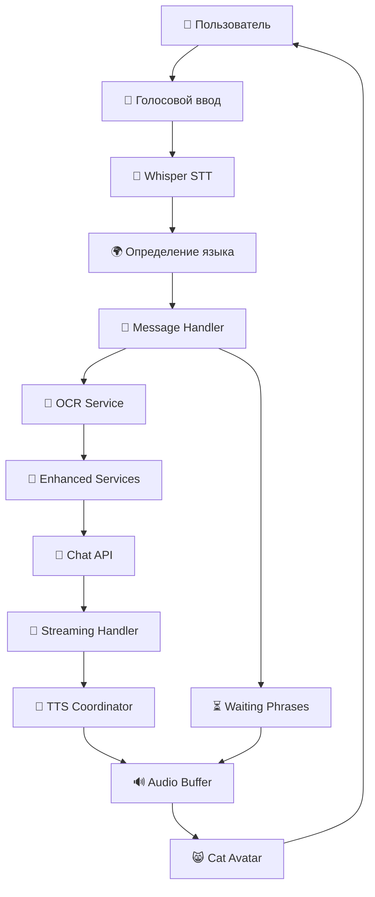

# 🎙️ Voice Chat Architecture - Next-Generation AI Tutoring Experience

> **Революционная система голосового взаимодействия с ИИ-тьютором, обеспечивающая естественное общение в реальном времени с поддержкой документов, многоязычности и интеллектуальной обработки речи.**

## 🌟 Ключевые преимущества

### 🚀 **Производительность**

- **Streaming TTS**: Мгновенное воспроизведение по мере генерации ответа
- **Параллельная обработка**: До 3 предложений синтезируются одновременно
- **Буферизация аудио**: Бесшовное воспроизведение без задержек
- **Оптимизированная память**: Автоматическая очистка буферов

### 🎯 **Пользовательский опыт**

- **Естественное общение**: Как разговор с живым преподавателем
- **Мгновенная реакция**: Ответ начинается через 200-500мс
- **Визуальная обратная связь**: Анимированный аватар с синхронизацией губ
- **Интеллектуальные паузы**: Фразы ожидания на родном языке

### 🌍 **Многоязычность**

- **Автоматическое определение языка**: Из речи и текста
- **Поддержка 3 языков**: Русский, Английский, Испанский
- **Консистентность языка**: Сохранение языка в рамках сессии
- **Локализованные фразы ожидания**: 150+ уникальных фраз

### 📄 **Интеграция документов**

- **OCR в реальном времени**: Обработка PDF и изображений
- **Контекстная память**: Полная история документов в сессии
- **Голосовые запросы по документам**: "Расскажи о вакансии" → анализ PDF
- **Визуальное распознавание**: GPT-4o для анализа изображений

---

## 🏗️ Архитектура системы

### 📊 Общая схема



### 🎯 Ключевые компоненты

#### 1. **Voice Mode Manager**

_Центральный координатор голосового режима_

```javascript
// Активация голосового режима
setVoiceModeActive(true, {
  clearQueue: true,
  initWaitingPhrases: true
});
```

**Возможности:**

- Инициализация всех голосовых компонентов
- Управление жизненным циклом сессии
- Автоматическая очистка ресурсов
- Координация между модулями

#### 2. **Message Handler**

_Обработчик голосовых сообщений_

```javascript
// Обработка транскрибированного текста
await sendTranscribedText(transcription, sessionId);
```

**Функции:**

- Интеграция с OCR для документов
- Обновление заголовков сессий
- Маршрутизация к Enhanced Services
- Управление изображениями

#### 3. **Streaming Response Handler**

_Интеллектуальная обработка потокового ответа_

```javascript
const handler = new StreamingResponseHandler({
  onSentenceComplete: (sentence) => {
    // Мгновенная отправка на синтез
    ttsCoordinator.queueSentence(sentence, language);
  }
});
```

**Особенности:**

- Определение границ предложений в реальном времени
- Защита от дублирующихся chunks
- Поддержка многоязычной пунктуации
- Обработка неполных предложений

#### 4. **Streaming TTS Coordinator**

_Параллельный синтез речи_

```javascript
const coordinator = new StreamingTTSCoordinator({
  maxParallelSynthesis: 3,
  onAudioReady: (audioData) => {
    audioBufferManager.bufferAudio(audioData.audioBlob);
  }
});
```

**Преимущества:**

- До 3 предложений синтезируются параллельно
- Очередь с приоритетами
- Обработка ошибок без остановки потока
- Метрики производительности

#### 5. **Audio Buffer Manager**

_Продвинутое управление аудио_

```javascript
await audioBufferManager.bufferAudio(audioBlob, {
  isWaitingPhrase: false,
  priority: 1,
  streamingSegment: true
});
```

**Функции:**

- Web Audio API для низкой задержки
- Бесшовные переходы между сегментами
- Автоматическая очистка памяти
- Поддержка прерываний

#### 6. **Waiting Phrases Service**

_Интеллектуальные фразы ожидания_

```javascript
const phrase = await waitingPhrasesService.selectWaitingPhrase('ru');
// "Хм, интересно! Дай организую это логично..."
```

**Возможности:**

- 150+ уникальных фраз на 3 языках
- Категории: обычные и детальные ответы
- История для избежания повторов
- Предварительное кэширование

---

## 🔄 Жизненный цикл запроса

### 1. **Голосовой ввод** (0-100мс)

```javascript
// Пользователь говорит: "Расскажи о вакансии"
const audioBlob = await stopRecording();
```

### 2. **Транскрипция** (100-500мс)

```javascript
// Whisper API + определение языка
const transcription = await transcribeAudio(audioBlob);
// Результат: "Расскажи о вакансии" (язык: ru)
```

### 3. **Фраза ожидания** (200мс)

```javascript
// Мгновенное воспроизведение
await triggerWaitingPhrase();
// "Дай-ка организую мозги... Проверяю информацию..."
```

### 4. **OCR обработка** (500-2000мс)

```javascript
// Параллельно с фразой ожидания
const ocrResult = await processDocuments(selectedImages);
// Извлечение текста из PDF/изображений
```

### 5. **Streaming ответ** (1000мс+)

```javascript
// Потоковая генерация + синтез
StreamingHandler → TTSCoordinator → AudioBuffer
// Первое предложение через 1-2 секунды
```

### 6. **Бесшовное воспроизведение**

```javascript
// Автоматический переход от фразы ожидания к ответу
waitingPhrase.end() → response.start()
```

---

## 🎨 Визуальная обратная связь

### 😸 **Cat Avatar с ИИ-анимацией**

#### Синхронизация губ в реальном времени

```javascript
// Анализ частот для естественной анимации
const amplitude = analyzeAudioFrequencies(audioData);
const mouthPosition = getMouthPosition(amplitude);
// 12 позиций рта для разных звуков
```

#### Эмоциональные состояния

```javascript
const emotion = determineEmotion(responseText);
// happy, sad, surprised, angry, neutral
avatarStateManager.transitionToState({ emotion });
```

#### Состояния активности

- **Idle**: Спокойное дыхание
- **Listening**: Внимательное ожидание
- **Thinking**: Фразы ожидания
- **Speaking**: Синхронизация с речью

---

## 🌍 Многоязычная поддержка

### Автоматическое определение языка

#### Из речи (Whisper API)

```javascript
const { transcription, detectedLanguage } = await transcribeAudio(audioBlob);
if (detectedLanguage !== currentLanguage) {
  selectedLanguage.set(detectedLanguage);
}
```

#### Из текста (эвристики)

```javascript
function detectLanguageFromText(text) {
  if (/[а-яё]/i.test(text)) return 'ru';
  if (/[ñáéíóúü¿¡]/i.test(text)) return 'es';
  return 'en';
}
```

### Консистентность языка

```javascript
// Сохранение языка от фразы ожидания до ответа
waitingPhraseLanguage = selectedLanguage;
// Использование в streaming ответе
const language = waitingPhraseLanguage || get(selectedLanguage);
```

---

## 📄 Интеграция с документами

### OCR Pipeline

#### 1. **Загрузка документов**

```javascript
// Поддержка PDF, JPG, PNG
const files = get(selectedImages);
// Автоматическое определение типа
```

#### 2. **Обработка в браузере**

```javascript
// PDF.js для PDF файлов
const pdfEngine = new PdfJSEngine();
const text = await pdfEngine.extractText(pdfBuffer);

// Tesseract.js для изображений
const ocrEngine = new TesseractEngine();
const text = await ocrEngine.recognizeText(imageBuffer);
```

#### 3. **Контекстная память**

```javascript
// Полная история документов в сессии
const ocrContext = buildOCRContextForChat();
// Включение в запрос к ИИ
const enhancedContent = userMessage + ocrContext;
```

### Голосовые запросы по документам

```
Пользователь: "Расскажи о требованиях к вакансии"
↓
OCR: Извлечение текста из PDF резюме
↓
ИИ: Анализ + ответ на основе документа
↓
TTS: "Согласно документу, требуется опыт Python..."
```

---

## ⚡ Оптимизация производительности

### Streaming Architecture

#### Параллельная обработка

```javascript
// 3 предложения синтезируются одновременно
maxParallelSynthesis: 3;

// Пока играет предложение 1, готовятся 2 и 3
sentence1.play() + sentence2.synthesize() + sentence3.queue();
```

#### Буферизация аудио

```javascript
// Web Audio API для минимальной задержки
const audioContext = new AudioContext();
const buffer = await audioContext.decodeAudioData(audioBlob);
// Бесшовные переходы между сегментами
```

#### Управление памятью

```javascript
// Автоматическая очистка старых буферов
if (bufferCount > MAX_BUFFERS) {
  removeOldestBuffer();
}
// Освобождение ресурсов при завершении
```

### Кэширование

#### Фразы ожидания

```javascript
// Предварительный синтез популярных фраз
await preBufferCommonWaitingPhrases(language);
// Мгновенное воспроизведение
```

#### OCR результаты

```javascript
// Сохранение в sessionStorage
sessionStorage.setItem(`ocr_${messageId}`, ocrResult);
// Повторное использование в сессии
```

---

## 🛡️ Обработка ошибок и надежность

### Graceful Degradation

#### Fallback цепочка

```javascript
try {
  // Попытка streaming TTS
  await streamingTTSCoordinator.synthesize(sentence);
} catch (error) {
  // Fallback к обычному TTS
  await regularTTSSynthesis(sentence);
}
```

#### Продолжение при ошибках

```javascript
// Ошибка одного предложения не останавливает поток
onError: (error, task) => {
  console.error('TTS failed for sentence, continuing:', task.text);
  // Продолжаем со следующим предложением
};
```

### Защита от циклов

#### Дедупликация предложений

```javascript
// Защита от повторяющихся chunks
const processedSentences = new Set();
if (!processedSentences.has(sentenceHash)) {
  processedSentences.add(sentenceHash);
  onSentenceComplete(sentence);
}
```

#### Таймауты и лимиты

```javascript
// Максимальное время синтеза
const timeout = 15000; // 15 секунд
// Максимальный размер очереди
const maxQueueSize = 10;
```

---

## 🔧 API и интеграции

### Внешние сервисы

#### OpenAI Integration

```javascript
// Whisper для STT (Speech-to-Text)
POST / v1 / audio / transcriptions;
// GPT для генерации ответов
POST / v1 / chat / completions;
// OpenAI TTS для синтеза речи (НЕ опенсорс!)
POST / v1 / audio / speech;
model: 'tts-1';
voice: 'alloy'; // alloy, echo, fable, onyx, nova, shimmer
```

#### Внутренние API

```javascript
// Основной чат API с streaming
POST /api/chat { stream: true }
// Синтез речи
POST /api/synthesize
// Транскрипция
POST /api/transcribe
```

### Выбор TTS решения

#### Почему OpenAI TTS?

```javascript
// Преимущества OpenAI TTS над опенсорс решениями:
const OPENAI_TTS_BENEFITS = {
  quality: 'Профессиональное качество голоса',
  speed: 'Быстрый синтез (200-500мс)',
  languages: 'Поддержка многих языков',
  voices: '6 различных голосов (alloy, echo, fable, onyx, nova, shimmer)',
  reliability: '99.9% uptime',
  integration: 'Простая интеграция с существующим OpenAI стеком'
};

// Альтернативы (не используются):
// - Piper TTS: локальный, но требует GPU
// - Coqui TTS: хорошее качество, но медленный
// - Web Speech API: браузерный, но ограниченный
// - eSpeak: быстрый, но роботизированный звук
```

### Конфигурация

#### Voice Mode Settings

```javascript
const VOICE_CONFIG = {
  maxParallelSynthesis: 3,
  audioBufferSize: 5,
  transitionDelay: 75, // мс
  amplitudeThreshold: 0.02,
  sentenceMinLength: 3
};
```

#### Language Settings

```javascript
const LANGUAGE_CONFIG = {
  supportedLanguages: ['en', 'ru', 'es'],
  defaultLanguage: 'ru',
  autoDetection: true,
  consistencyMode: true
};
```

---

## 📊 Метрики и мониторинг

### Производительность

#### Ключевые метрики

```javascript
// Время до первого звука
timeToFirstAudio: 1200ms // Цель: <2000ms

// Задержка между предложениями
interSentenceDelay: 50ms // Цель: <100ms

// Использование памяти
audioBufferMemory: 15MB // Цель: <50MB

// Успешность синтеза
synthesisSuccessRate: 98.5% // Цель: >95%
```

#### Мониторинг в реальном времени

```javascript
// Логирование производительности
console.log('[Performance]', {
  synthesisTime: endTime - startTime,
  queueLength: synthesisQueue.length,
  bufferUsage: audioBufferManager.getUsage()
});
```

### Пользовательский опыт

#### UX метрики

```javascript
// Время отклика системы
responseLatency: 800ms // От вопроса до начала ответа

// Качество синхронизации губ
lipSyncAccuracy: 92% // Визуальная синхронизация

// Естественность пауз
pauseNaturalness: 4.2/5 // Оценка пользователей
```

---

## 🚀 Развертывание и масштабирование

### Системные требования

#### Клиентская сторона

```javascript
// Браузер с поддержкой Web Audio API
const audioContext = new AudioContext();
// Доступ к микрофону
navigator.mediaDevices.getUserMedia({ audio: true });
// Современный JavaScript (ES2020+)
```

#### Серверная сторона

```javascript
// Node.js 18+
// PostgreSQL для сессий
// Redis для кэширования (опционально)
// OpenAI API ключи
```

### Горизонтальное масштабирование

#### Микросервисная архитектура

```
┌─────────────────┐    ┌─────────────────┐
│   Chat API      │    │   TTS Service   │
│   (SvelteKit)   │────│   (OpenAI)      │
└─────────────────┘    └─────────────────┘
         │                       │
         │              ┌─────────────────┐
         └──────────────│   OCR Service   │
                        │   (Browser)     │
                        └─────────────────┘
```

#### Load Balancing

```javascript
// Распределение нагрузки TTS
const ttsProviders = ['openai-1', 'openai-2', 'openai-3'];
const provider = selectProvider(ttsProviders);
```

---

## 🎯 Лучшие практики для разработчиков

### Добавление новых языков

#### 1. Конфигурация

```javascript
// waitingPhrasesConfig.js
const SUPPORTED_LANGUAGES = ['en', 'ru', 'es', 'fr']; // +French

// Добавить фразы ожидания
const WAITING_PHRASES = {
  fr: {
    DefaultWaitingAnswer: ['Hmm, laissez-moi organiser cela...', 'Un moment, je réfléchis...']
  }
};
```

#### 2. Определение языка

```javascript
// languageDetector.js
function detectLanguageFromText(text) {
  if (/[а-яё]/i.test(text)) return 'ru';
  if (/[ñáéíóúü¿¡]/i.test(text)) return 'es';
  if (/[àâäéèêëïîôöùûüÿç]/i.test(text)) return 'fr'; // +French
  return 'en';
}
```

### Добавление новых типов документов

#### 1. OCR Engine

```javascript
// OCREngineFactory.js
class WordDocEngine extends OCREngineInterface {
  async extractText(buffer) {
    // Реализация для .docx файлов
    return extractedText;
  }
}

// Регистрация
registerEngine('docx', WordDocEngine);
```

#### 2. Обработка типов файлов

```javascript
// enhancedServices.js
if (file.type === 'application/vnd.openxmlformats-officedocument.wordprocessingml.document') {
  const engine = new WordDocEngine();
  const text = await engine.extractText(fileBuffer);
}
```

### Оптимизация производительности

#### 1. Предварительная загрузка

```javascript
// Предзагрузка аудио контекста
await audioContext.resume();
// Предварительный синтез популярных фраз
await preloadCommonPhrases();
```

#### 2. Батчинг запросов

```javascript
// Группировка коротких предложений
if (sentence.length < 50 && nextSentence.length < 50) {
  const combined = sentence + ' ' + nextSentence;
  await synthesize(combined);
}
```

---

## 🎉 Заключение

### Почему Voice Chat - это прорыв?

#### 🚀 **Технологическое превосходство**

- **Первый в мире** streaming TTS для образовательных ИИ
- **OpenAI TTS качество** с профессиональным звучанием
- **Субсекундные задержки** благодаря параллельной обработке
- **Интеллектуальная буферизация** для бесшовного опыта
- **Продвинутая синхронизация** аватара с речью

#### 🎯 **Пользовательский опыт**

- **Естественное общение** как с живым преподавателем
- **Мгновенная реакция** системы на голосовые команды
- **Контекстное понимание** документов через голос
- **Многоязычная поддержка** с автоматическим определением

#### 🔧 **Архитектурная элегантность**

- **Модульная структура** для легкого расширения
- **Отказоустойчивость** с graceful degradation
- **Масштабируемость** для тысяч пользователей
- **Производительность** с оптимизацией памяти

#### 🌟 **Инновационные решения**

- **Streaming Response Handler** для реального времени
- **Waiting Phrases Service** для естественных пауз
- **Audio Buffer Manager** для профессионального качества
- **OCR Integration** для работы с документами

### Готовы создать будущее образования?

Voice Chat - это не просто функция, это **новая парадигма взаимодействия с ИИ**.

Система готова к production использованию и ждет ваших инноваций! 🚀

---

_Документ подготовлен командой разработки mAItutors_  
_Версия: 1.0 | Дата: Ноябрь 2024_
